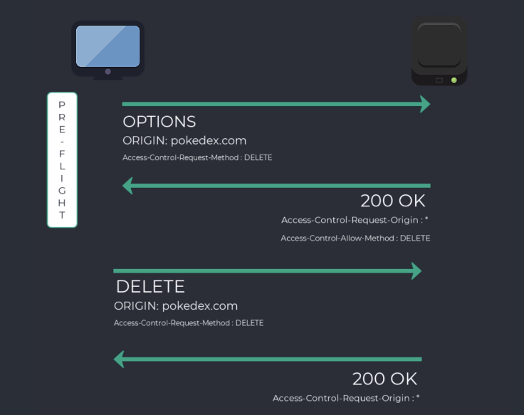

# Développer une API REST avec Node.js

Développez facilement votre API Rest Node.JS à partir d'un dossier vide, avec Node.JS, Express.js et MySQL.

- Créer votre première API Rest NodeJS rapidement, à partir d'un dossier vide
- Installer et interagir efficacement avec une base de données SQL grâce à l'ORM Sequelize
- Comprendre l'éco-système de NodeJS, des API Rest et du Backend
- Sécuriser votre API Rest avec JWT et l'encryptage des mots de passe
- Ajouter une application Angular, React ou Vue à votre API Rest
- Respecter les bonnes pratiques de développements NodeJS et ExpressJS
- Déployer des API Rest modernes, rapides et scalables sur Heroku

## Présentation de Node.js

Environnement d'exécution pour JS.
Exécute code JS côté serveur et non dans navigateur.

### Environnement informatique

Lieu où le code est exécuté, le code du dévelopeur devient un produit utilisable par tous (site web, appli).

JavaScript => environnement d'éxécution => site

L'environnement d'exécution d'un site web => navigateur.
Le navigateur contient un **moteur** jS pour interpréter JS, chaque navigateur à son propre moteur.

- IE: chakra,
- Mozilla: spider monkey,
- chrome: V8.

=> Si code js est interprété par le navigateur, il peut ne pas fonctionner sur un autre navigateur, mais les technologies modernes permettent de lisser ce comportement.

JS => moteur JS => appli web : Node.js pas dedans car côté naviagteur, Node.js = côté serveur (backend).

**Node.js utilise JS donc mosteur JS, ce moteur est inclus dans Node.js = V8 (open source).**

>Environnement web = navigateur + moteur js
>Environnement serveur = Node.js + V8 + modules internes à JS, code JS côté serveur

### Node.js versus JS

Les deux sont associés mais différents:

|JS|Node.js|
|-------|------|
|Langage de programmation|Environnement pour le code|
|Code -> exécution moteur navigateur|JS fonctionne à l'extérieur du navigateur|
|Utilisé pour n'importe quelle action à implémenter dans une application web: navigation, ...|Utilisé pour effectuer des opérations sur n'importe quel OS|
|Intzerprété par moteur du navigateur|Moteur V8 inclus|

### Node.js

- Utilise le langage JS
- Facilite fron/back
- utilise le même gestionnaire de paquet NPM, Node Package Manager. Gestion des dépendances avec Node.js
- Rapide
- **Possède une architecture non bloquante**
- Flexible, léger, peu de fonctionnalités (on y ajoute nos modules)
- Contient un écosystème de librairies Open Source grâce à NPM

Sa philosophie:

Rapidité V8 + architecture non bloquante

V8: outil qui interprète js rapidement, méthode de compilation Just-In-Time = transformation JS en code compris par la machine sans passer par un interpréteur (aucun code intermédiaire).

Module non bloquant: événement et  asynchrone dans Node.js.
**Architecture bloquante** = programme récupère des données depuis un serveur distant pour les afficher à l'utilisateur. Il fauat attendre de récupèrer les données demandées pour continuer le programme.
**Architecture non bloquante** = traitement en fonction des événements qui surviennent, , les traitements asynchrones ne bloquent pas l'exécution du programme.

### Types d'applications pouvant être développées avec Node.js

- Développement d'un site entier:
Dans Node. js, il existe un module HTTP qui permet de développer un serveur HTTP.
Toutes les parties serveur site: connexion BDD, routes navigation, renvoie code HTML/CSS, inclure JS depuis Node.js...
JS tapé pour Node.js sera interprété par V8 (code serveur) et le deuxième retourné dans la page client sera interprété par le moteur du navigateur dans utilisateur.
Node.js est plus réactif dans une application avec front et back séparé.
site web => demande page => envoie serveur
appli web => serveur envoie une seule page pour le site puis JS client prend le relais en affichant masquant les données néessaires.
Donc plus de réactivité, aucun rechargement.

- API REST:
API application programming Interface.
Objectif: gestion des accès BDD, et exposer une API REST aux différentes parties visibles du projet.
On peut, par exemple, récupèrer l'API de l'appli web suite au développement de l'application mobile.
Les opérations sur l'API REST sont **unidirectionnelles** = on envoie d'abord une requête à l'initiative du client puis seulement on attend une réponse.

- Application en temps réel:
Toutes les appliactions qui ont besoin de communqiuer rapidement entre le serveur et le front, comme whatsapp...
Dnas le cas d'une messagerie il faut que les informations soient rapides ( messages reçus,...) => implémenter une communication bidirectionnelle entre le serveur et l'application fontaine.
Cela est possible grâce à Node.js et Socket.io (librairie qui utilise cette communication en temps réel).
**Socket.io** possède deux parties:
bibliothèque côté client qui s'exécute dans le navigateur ou équivalent pour une appli mobile, et côté serveur avec Node.js.

- Scripts:
Node.js est utilisé pour développer des scripts = petits programmes qui peuvent être exécuté sur la machine locale.

### JS ESI ou ECMAScript6

Dernière version standardisée de JS (2015).
Dernières versions de Node.js supportent déjà ce standard.
Donc aucune installation.

node.green => liste toute les fonctionnalités de JS et indique si elles sont disponibles ou non dans telle ou telle version de Node.js.

### Node.js et TypeScript

TypeScript est un langage open source développé par Microsoft et permet d'ajouter le typage au langage JS.
Permet d'indiquer si une variable est de tel type, telle fonction doit renvoyer tel ou tel type.
Plus pertinent côté front, permet de structurer l'état de la donnée.

Nouvelle façon d'utiliser JS en dehors d'un navigateur pour développer toutes sortes d'application.

## Installer Node.js

Récupèrer le fichier d'installqtion => nodejs.org/fr, il existe deux versions:
- LTS = long term support, version la plus stable pour démarrer un projet, cette version sera viable le plus longtemps à l'avenir,
- La version actuelle, soit la dernière version actuelle. Pratique pour tester les fonctionnalités mais peut êttre adapatable.

Installation de deux outils:
installation de Node.js, et NPM(node package manager) qui permet d'installer et gèrer les paquets JS (exemple: Express.js).

## Démarrer un projet Node.js

Dossier, fichier point entrée de l'application = App.js.

Terminal, exécution => node APP.js ou index, server main.js.

Pour démarrer un projet Node.js ou js, il est nécessaire de mettre en place un fichier **package.json** (rapide description du projet, et liste des dépendances de l'appli, et des dépendances des dépendances. On peut égelment y mettre en place des scripts pour  simplifier et automatiser des tâches).
=> soit à la main, soit avec une commande npm = **npm init**.
Dans le fichier, remplacer test par start dans scripts, et enlever echo => node app.js.
Puis npm run start => script appelle node app.js et démarre projet.

### Ajout des dépendances

Pour API REST:
**Express. js = framework pour créer des API REST avec Node.js.**
=> installation:
npm install express --save
npm télécharge express, dans dossier node modules.
npm regarde package.json mais de la librairie express, car paquet js qui a lui même ses dépendances.

--save afin de déclarer express dans les dépendances, et non juste en local sur machine via node modules.

Le dossier node module est géré par npm, ne pas y toucher.

### Express

Envoie d'une requête get via API REST, et a retourné une réponse:

    const express = require('express');
    //  Récupération du paquet express dans code avec require => récup dépendance dans node modules
    const app = express();
    // serveur web sur lequel fonctionnera notre API REST
    const port = 3000 ;
    // port sur lequel nous allons démarrer notre API REST par la suite

    app.get('/', (req, res) => res.send('Hello express'));
    // déf du premier endpoint, coeur d'express. 
    // Chaque élément est important pour définir un point de terminaison:
    // 1- coeur de la requête: get, prend 2 arguments en param => le chemin de la requête, chemin de la route qui va permettre de traiter ce point de terminaison (ici route par défaut) et => fonction qui fournit une réponse à notre client quand point de terminaison est appelé, cette fonction prend également 2 arguments req = récupération de l'objet request qui correspond à la requête reçue en entrée par notre point de terminaison, et res = response objet à renvoyer depuis express au client.
    // Ici on utilise méthode send de l'objet response pour renvoyer le msg

    app.listen(port, () => console.log(`Notre appli Node est démarrée sur : http://localhost: ${port}`));
    // démarre API REST sur port 3000

Lancement de l'API REST avec:
npm run start

En cas de changement de code, il faut couper la commande npm start et relancer, et rafraîchir le navigateur. Il faut y remédier.

### Nodemon

Pour éviter de couper et relancer npm run start => paquet Node.js, **nodemon**.
Il s'occupe d'exécuter le projet Node.js en tâche de fond, à chaque modification, il relance automatiquement l'API REST en prenant compte les dernières modifications.

#### Installation nodemon

**npm install nodemon --save-dev => il existe deux types de dépendances: dépendances du projet dans dependencies, --save et dependencies du projet pendant le développement, devDependencies, comme nodemon.Une fois l'application déployée, elle n'aura pas à être relancée.**

Il faut mettre à jour le script de démarrage: nodemon app.js.

npm run start 

**Accès navigateur: localhost:3000**

>C'est quoi un serveur localhost ? Qu'est-ce que Localhost ? Et comment cela s'applique à ... Dans le réseau informatique, « localhost » fait référence à l'ordinateur sur lequel un certain programme est en cours d'exécution. Par exemple, si vous exécutez un programme sur votre propre ordinateur (comme un navigateur Web ou un environnement de développement Web local), alors votre ordinateur est le « localhost ».

## Découvrir les routes 

Ajout de endpoint à l'API REST: déclaration d'une nouvelle route auprès d'express =>
**point de terminaison express = app.method(chemin, gestionnaire(req, res));**
=> app = instance de l'application express
methode http utilisée
chemin vers ressources sur laquelle on intervient
retour réponse client.

Implémenter nouvelle route:

    app.get('/api/pokemon/1', (req, res) => res.send("Hello Bulbizar"));
    // appel nouvelle route dans navigateur => localhost:3000/api/pokemons/1
    = nouvel endpoint dans API REST

### Passer un paramètre depuis l'URL

Si trop de routes?
=> express permet de récupèrer des paramètres de l'URL depuis les endpoints, récupération de l'id du pokemon dans l'URL , la récupèrer dans le point de terminaison, et construire une réponse à partir de ces informations.
Depuis notre endpoint, on possède déjà un objet représentant la requête entrante = req, pour accèder aux paramètres id de l'URL => req.params.id.
L'on peut faire passer plusieurs paramètres différents à un endpoint.
Exemple:

### Mettre en place un environnement de données

Actuellement, on ne renvoie que des chaînes de caractères statiques.
Mise en place d'un jeu de données.
Module js et récupération avec un point de terminaison:

    module.exports = pokemons;
    <!-- dans fichier mock-pokemon , création du module pour import -->
    let pokemons = require('./mock-pokemon');
    // importation du module mock-pokemon, voir fichier app.js
    
### Relier les données et routes d'Express

    app.get('/api/pokemons/:id', (req, res) => {
    // ajout valeur dynamique id avec :id, acceptation du paramètre. Express le récupère et le transmets à notre point de terminaison via l'objet req.
        // const id = req.params.id;
        // récupération des paramètres id de l'URL
        const id = parseInt(req.params.id);
        //  conversion de la chaîne de caractère en number 
        // res.send(`Vous avez demandé le pokemon n° ${id}`); = message indiquant l'id choisi
        const pokemon = pokemons.find(pokemon => pokemon.id === id);
        // constante qui permet de récupèrer dans le fichier pokemon l'objet choisi grâce à l'id
        res.send(`Vous avez choisi: ${pokemon.name}`);
        // message envoyé: nom du pokemon, nam dans objet pokemon suite à la sélection de l'id.
        // message erreur name undefined, méthode find ne renvoie rien.
        // Routeur d'express passe les paramètres sous forme de chaînes de caractères systématiquement, le paramètre id devient une chaîne de caractère => pokemon.id === id => comparaison de deux valeurs non identiques => false, il faut convertir la chaîne de caractère en un nombre => méthode js native parse int

## Les réponses Json

Rappel:
rôle d'une API REST => intercepter une requête http, puis retourner une réponse contenant les informations demandées par le client au format **JSON**.
Mais la requête HTTP est elle valide, car pour le moment l'on ne renvoie que des chaînes de caractères avec res.send().

s

Renvoie d'une vraie réponse HTTP, les différents éléments nécessaires pour retourner une vraie réponse HTTP:
- les **données**: sont elles bien retournées?
- **format JSON**: données doivent être au format JSON,
- **le type mime**: il est nécessaire d'indiquer un type mime lorsque l'on utilise le protocole HTTP. Ajout sous forme d'une entête à la réponse HTTP,
  Demande d'une simple page via le navigateur => type Mime est ajouté.
- **le code de statut**: code à 3 chiffres indiquant le statut de la réponse, non présent dans la requête HTTP mais seulement dans la réponse ex: 200 ok 404).

  Dans le cas d'une réponse JSON, le type Mime est = Content-Type: application/json.
  Page web simple: Content-Type: text/html

### Retourner une réponse au format JSON

La conversion de nos réponses au format JSON se fait en 2 étapes:
- convertir le corps de la réponse en JSON plutôt que des chaînes de caractères,
- Ajouter un type MIME dans la réponse http pour indiquer que cette réponse contient du JSON.
=>
**Express permet cela grâce à une méthode: res.json().** Elle prend en charge le retour au format Json et le type Mime application.json.

### Embellir la réponse du navigateur

Renvoie réponse au format json, ce sont des applications donc du code qui vont consommer les réponses de notre API REST, mais la réponse peut être illisible pour nous en phase de développement ou debbug.
La plupart des navigateurs récents permettent d'obtenir une extension pour améliorer l'affichage des réponses au format JSON:
**Chrome: JSON viewer**.

### Organiser la structure des réponses

La réponse est-elle complète?
exemple, retour des données, les infos sont bonnes mais à la place des développeurs front end qui consomment l'API REST, il faut confirmer que tout c'est bien déroulé ou erreurs.
Il vaut mieux être trop précis avec une API REST.

Création fichier helper.js.

    exports.success = (message, data) => {
        return {
            message: message,
            data
        }
    }
    // méthode success avec deux param pour construire une réponse
    // export
    // il existe une syntaxe d' ecma 6 permettant de fusionner la prropriété et la valeur d'un objet js s'ils ont le même nom
    // exemple:
    // const pokemon = { name: name};
    // avec raccourci ECMAScript 6: const pokemon ={name};

    exports.success = (message, data) => {
        return {
            message, data
        }
    }

### Améliorer les points de terminaison

helper => améliore et complète la réponse pour le consommateur de l'API REST

Ajout message dans les réponses json

    res.json(helper.success(message, pokemon));
    => retour d'une réponse complète

On peut alléger le code, en récupérant success plutôt que helper en entier = **affectation destructurée**

    // const helper = require('./helper.js');
    const {success} = require('./helper');

### Retourner une liste de données au format json

Exercice2:
Ajouter un endpoint qui renvoie la liste complète des pokemons au format json, avec un message.
Cahier des charges:
- reprendre la route api/pokemons pour avoir la totalité des pokemons,
- retourner les 12 pokemons,
- un message indiquant que l'on retourne les 12 pokemons,
- format json.

    app.get('/api/pokemons', (req, res) => {
        const message = 'La liste des pokémons a bien été récupérée.'
        res.json(success(message, pokemons)) 
    })

## Les middlewares Express

### Définition

Express est en grande partie basé dessus.
**Ce sont des fonctions js capables d'intéragir avec des requpetes entrantes et sortantes de l'API REST.**

Le middleware A, permet d'appliquer un traitement aux requêtes entrantes et sortantes.

Les middlewares fonctionnenet par dessus les endpoints existants.
Ils peuvent accèder aux objets res et res d'express.
Une fois le traitement des middlewares effectués, il faut l'indiquer grâce à la fonction **next()**.

Les éléments req, res et next sont transmis par express directement.

    const middleware(req, res, next) => {
        <!-- traitement quelconque, on peut intervenir sur les objets req et res, puis on indique à express que le traitement est terminé -->
        next()
    }
     => middleware

Fonctions js qui ont accès à certaines données d'Express.

### Cas d'utilisation

Les middlewares sont une fonctionnalité d'express suffisamment polyvalente pour effectuer des tâches très diverses.

5 catégories d'utilisation:

- Middleware d'application:

    var app = express();

    <!-- On passe u  middleware en paramètre de la méthode use(): -->
    app.use(function (req, res, next){
        console.log('Time:', Date.now());
        next();
    });

Ce sont les middlewares les plus courants lorsque l'on débute dans le domaine, reliés directement à l'instance d'express grâce à la méthode use().
Le middleware sera exécuté à chaque fois que l'API REST recevra une commande.
Dans ce cas, on affichera un message dans le terminal de commande avec la date complète à laquelle notre API REST a reçu la requête entrante.
On peut utiliser ce type de middleware pour loger tout type d'événement ou pour autre traitement commun aux requêtes entrantes ou sortantes de notre API REST.

- le middleware du routeur:

Il fonctionne directement au niveau du routeur d'Express.
Très similaire au précédent mais pas relié à l'instance d'Express. On le branche sur une instance d'express routeur:
express.Routeur() => création de sous ensemble de routes et définir une hiérarchie et une organisation entre les routes de l'API REST, dans le cas où celle-ci devient importante en taille.

- middleware traitement d'erreur:

    app.use(function(err, req, res, next){
        console.log(err);
        res.send('erreur!');
    });

Il prend quatre arguments en compte pour être identifié, sinon avec 3 express pensra qu'il s'agit d'un middleware ordinaire et ne géreré pas les erreurs correctement.

- le middleware intégré

Il existait quelques middlewares directement intégrés à Express, comme modules dans Node.js.
Mais un seul reste depuis la v4 => express.static
Il a comme responsabilité de servir des documents statiques depuis une API REST comme des images, PDF...
Les autres sont toujours maintenus et utilisables, mais disponibles sous forme de dépendances extérieures à installer.

- les middlewares tiers:

Disponibles sous la forme d'une dépendance extérieure.
Sont des modules js à installer dans node modules.

### Créer un middleware sur mesure

Création d'un middleware qui affichera les requêtes reçues par l'API REST directement sur le terminal de commande où s'exécutent notre backend.

Déclaration nouveau middleware = logger directement dans le point d'entrée app.js.

    // const logger = (req, res, next) => {
    //     console.log(`URL: ${req.url}`);
    //     next();
    // }
    // middleware logger, 3 paramètres
    //  la req http reçue en entrée , la réponse http qui va être exposée au client, la méthode next fournie par Express qui ndique que le traitement est terminé.
    // loggue l'URL des points de terminaison appelée par les consommateurs de notre API REST.
    // l'on peut supprimer la var intermédiaire , plus concis

    // app.use(logger);
    // utilisation du nouveau middleware dans l'application express grâce à use
    // après suppression de la var intermédiaire:
    app.use((req, res, next)=> {
        console.log(`URL: ${req.url}`);
        next();
    });
Permet de débugger à la main.

### Installer un middleware déjà existant

Middleware **morgan** => s'occupe de la même chose que notre middleware précédent.
Permet de logger dans le terminal de commande toutes les requêtes entrantes vers notre API, en plus aboutie sans ligne de code.

Module js comme un autre.

npm install morgan --save-dev
Surtout utile pour le débugage en phase de dév.

Il faut ensuite l'importer dans app.js.

### Communication entre les middlewares

Ils puvent être combinés entre eux et former une chaîne de traitement complète.

Ils communiquent entre eux en transmettant leurs paramètres respectifs.
Il est possbile de chaîner des middleware sans transmission de paramètres.

Ajout d'un deuxième middlkeware et le combiner avec morgan.
Bien penser à appeler la fonction next pour chaque middleware, cela permet de transmettre l'exécution au middleware suivant dans la chaîne de traitement.

 => ajout favion à l'API REST

npm install serve-favicon --save

**L'extension d'une favicon est toujours favicon.ico**

    app
        .use(favicon(__dirname + '/favicon.ico'))
        .use(morgan('dev'));
    // combi des middleware, bien télécharger favicon
    // appel de la méthode use autant de fois que l'on a de middlewares à implémenter
    // on peut les chaîner les uns à la suite des autres afin d'établir un ordre en eux

__dirname est une variable d'environnement qui vous indique le chemin absolu du répertoire contenant le fichier en cours d'exécution.
Chaque middleware va renvoyer des données, la requête, la réponse, la fonction suivante à appeler après avoir terminé son traitement spécifique.

La méthode next est toujours appelée mais par le middleware directement.

## Création d'une API REST complète

Ajout d'un nouveau pokemon:
construire un nouvel endpoint qui acceptera la requête http: 
  - action http post,
  - URL de la ressource, ressource sur laquelle l'on souhaite intervenir = /api/pokemons, (collections de ressources),
  - les données du pokemon, au formaj json.
  

    app.post('/api/pokemons', (req, res) =>{
        // post auprès d'express avec url associée
        const id = 123;
        // définition id arbitraire, doit être unique pour générer url unique. On ne peut pas deviner un id déjà pris,  c'est la bdd de déterminer les id uniques, elle seule a accès à l'ensemble des pokemons existants
        const pokemonCreated = {...req.body, ...{id: id, created: new Date()}}
        // fusion des données du pokemon reçues via la requête http entrantes avec l'id unique généré + date de création
        pokemons.push(pokemon.created);
        // ajout à la liste existante
        const message1 = `le pokemon ${pokemonCreated.name} a bien été créé`;
        res.json(success(message1, pokemonCreated));
    });

Pour récupèrer le plus grand id existant dans la liste et incrémenter.
On va ajouter la méthode de génération d'id dans helper car fichier outil.

    // ajout méthode pour id
    exports.getUniqueId = (pokemons) => {
        const pokemonsIds = pokemons.map(pokemon => pokemon.id);
        // transfo tableau des pokemons en un tableau d'id des pokemons. méthode map comme for mais en retournant un nv tableau
        const maxId = pokemonsIds.reduce((a, b) => Math.max(a, b));
        // méthode js native reduce qui permet de comparer les éléments deux à deux dans un tableau 
        const uniqueId = maxId ++;
        return uniqueId;

Par la suite, c'est la bdd mySql qui s'en chargera.

    {
    "name": "Chenipan",
    "hp": 29,
    "cp":4,
    "picture": "https://assets.pokemon.com/assets/cms2/img/pokedex/detail/010.png",
    "types": ["Insecte", "Poison"]
    }

        app.post('/api/pokemons', (req, res) =>{
        // post auprès d'express avec url associée
        const id = getUniqueId(pokemons);
        // définition id arbitraire, doit être unique pour générer url unique. On ne peut pas deviner un id déjà pris,  c'est la bdd de déterminer les id uniques, elle seule a accès à l'ensemble des pokemons existants. usage méthode dans helper
        const pokemonCreated = {...req.body, ...{id: id, created: new Date()}}
        // fusion des données du pokemon reçues via la requête http entrantes avec l'id unique généré + date de création
        pokemons.push(pokemon.created);
        // ajout à la liste existante
        const message1 = `le pokemon ${pokemonCreated.name} a bien été créé`;
        res.json(success(message1, pokemonCreated));
    });

localhost:3000/api/pokemons

Pas les données id et created, c'est au backend d'attribuer un id unique, created pas de valeur dynamique depuis fichier json => c'est le serveur qui se charge de la date de création des ressources.

=>

    {
        "message": "le pokemon undefined a bien été créé",
        "data": {
            "id": 14,
            "created": "2023-06-22T12:46:26.225Z"
        }
    }
 =>renvoie chaîne de caractères, quand les dinnées http transitent via le protocole http, elles ne oeuvent l'être que sous la forme d'une chaîne de caractères.
Conversion en chaines de caractère en json.

### Parser nos données avec un middleware

Comment récupèrer des données au format json depuis notre API REST.
Il existe deux opérations majeures lorsque l'on utilise le format json:
- **On peut parser une chaîne de caractères afin d'obtenir du json. Grâce à la méthode native du nav: JSON.parse()**:
  
    const userString = '{"name: "john", "age": 33}'
    => réception données sous fore de chaîne de caractères

    const userJson = JSON.parse(userString);
    => on parse la chaîne de caractère afin d'obtenir du json utilisable partout dans le code, sans import car méthode native.

- on peut **stringyfier** un json afin d'obtenir une chaîne de caractères (retour client), méthode JSON.stringify:

    console.log(JSON.stringify(userJSON));
    => en paramètres données au format json.

Une chaîne de caractères en js n'a pas de propriété âge, alors que pour json c'est tout à fait possible.
Mise en place du middleware **body parser**.

=> npm install body-parser --save

### Modifier un pokemon

Avec action http **put**, mofication de l'ensemble de la ressource côté api rest;
Pour modifier seulement le nom, l'on ne modifie pas directement la ressource, l'on en crée une nouvelle avec la modification souhaitée et l'on remplace l'ensemble de la ressource souhaitée par la nouvelle => si deux modifications de la même ressource en même temps => risque de collision, contrairement à la soumission de la nouvelle version complète de la ressource, où les modifications peuvent s'enchaîner les une à la suite des autres logiquement.
**Chaque modification introduit qu'un seul et unique effet de bord sur le serveur plutôt que des changements de propriétés de tous les côtés.**
Pour modfier seulement une partie de ressource, en http, il existe une autre opération = **patch**, mais plutôt put. C'est une méthode plus fiable.
(put patch idempotence)[https://blog.octo.com/should-i-put-or-should-i-patch/]

test modification:

    {
    "name": "Anneso",
    "hp": 29,
    "cp":4,
    "picture": "https://assets.pokemon.com/assets/cms2/img/pokedex/detail/010.png",
    "types": ["Insecte", "Poison"]
    }

Dans le premier cas, on a des accolades supplémentaires entourant les propriétés qui sont ajoutées aux pokemon. La différence, dans le deuxième cas on ajoute une seule propriété, dans le premier un ensemble de deux propriétés à l'objet initial.

### Supprimer un pokemon

**delete**

**Dans une API REST, les collections de ressource sont également des ressources.**
Appel méthode delete sur URL /pokemons/1 => suppression d'un pokemon
Appel méthode delete sur URL /pokemons => suppression tout les pokemons.

### Exercice: vérifier que l'API fonctionne

Exécution des requêtes:
(npm start pour r"initialiser la liste)

## Lien avec la base de données

### Comprendre le rôle d'un ORM

**ORM**:
Object Relationnal Mapping, technique de programmation puissante qui permet de convertir les bases de données dans des langages comme js.
Masque complétement le fait qu'il y ait une base de données.
On continue le développement de l'API REST, mais on intéragir avec des objets js fournis par l'ORM.
On appelle des méthodes sur des objets JS.

Pas besoin de connaître le SQL.
Abstracation de la bdd, on peut changer de bdd sans modifier le code des requêtes sql,
Si on crée un nouvel objet js, l'ORM va s'occuper de le pousser en bdd (comme maj, suppression,...),
Fournit les requêtes les plus basiques,

### Installer l'ORM Sequelize

Il existe un ORM js pour les bdd SQL qui sort du lot: **Sequelize**.
Sequelize destinés aux utilisateurs de Node.js, entièrement basé sur les promesses de js.
Il permet donc de gérer les traitements async de manière plus efficace que de simples callback.
On a beaucoup de taitements async car lors de l'appel de la bdd, il y a un délai de réponse.
Intéraction avec la BDD depuis l'API REST.

Installation:

npm install sequelize --save
Il faut installer un **driver** => Sequelize crée une couche d'abstraction par rapport à la base de données utilisée. Cependant il y a bien un moment où l'on se connecte à la bdd, d'où le driver.
Chaque bdd SQL a son propre driver afin de permettre à l'ORM d'intéragir avec elle.

npm install --save mysql2
[Sequelize](https://sequelize.org/docs/v6/getting-started/)

### Connecter MySQL et l'API REST

Union Sequelize, mySQL, et API REST.
Il faut les assembler si l'on veut obtenir un résultat.
Sequelize est très simple à configurer =>
app.js ajout du code nécessaire pour se connecter à mySQL via Sequelize.
3 étapes:
- import Sequelize,
- création et configuration d'une instance de la classe de Sequelize,
- test si connexion ok avec méthode authenticate de Sequelize.

Création bdd:
create database pokedex;
use pokedex;

### Réflexion sur l'organisation du code

app.js a trop de rôles différents:
initialisation du serveur Express,
connexion à la bdd,
gestion des routes et points de terminaison,...
Il contient trop de code.

Notre architecture doit être adpatée aux besoins du projet, migration vers des modules js à part qui auront un rôle dédié.

3 rôles différents:
points de terminaison,
démarrage du serveur,
intéraction bdd.

Ici intégration de plusieurs outils et de configuration, on va construire par dessus notre API REST une véritable base de données.

## API REST et base de données

### Présentation des modèles Sequelize

Fonctionnement de Sequelize:

nous devons prendre connaissance du concept de modèle ou **models**: essence même de Sequelize.

Qu'est ce qu'un models:

Un models est une abstraction qui représente une table dans notre bdd.
Avec Sequelize on va donc déclarer un modèle Pokemon qui représentera la table contenant les pokemons du côté de notre bdd.

Un modèle est un objet js spécifique fourni par Sequelize, que l'on peut paramètrer en fonction de nos propres besoins.
Cet objet spécifique contient plusieurs propriétés qui décrivent à Sequelize la structure de l'entité qui doit être stocké (ex:adresse image, PV,...), pour chacune de ses propriétés il faut préciser le type de la propriété.

On déclare des objets avec certaines propriétes en js dans le code de l'PAI REST et Sequelize s'occupe du reste, il fournit la couche d'abstraction dont on a besoin.
Nous devrons donner un nom à chaque models Sequelize que nous créerons.
Exemple, un modèle pokemon afin de modéliser un pokemon. Sequelize va se baser sur ce nom et va lui ajouter la lettre s en suffixe pour déterminer le nom de la table.
Ainsi, la table associée au pokemon se nommera => pokemons.

Sequelize se contente de passer le nom au pluriel pour déterminer le nom d'une table.

### Créer un modèle Sequelize

Déclarer un objet js en respectant les conventions proposées par Sequelize.

Création d'un dossier src et dedans un dossier models.
Cela nous permettra de mieux structurer notre code et commencer à préparers l'architecture de notre API REST.

Le dossier src contiendra notre code source de notre API REST, le models contiendra les models Sequelize de notre projet.

Création du models pokemons.js dans models.

    module.exports = (sequelize, DataTypes) => {
    return sequelize.define('Pokemon', {
        // export  fonction de deux param: sequelize = objet représente la co à la bdd pour Sequelize, cet objet possède une propriété define qui permet de déclarer un nouveau models auprès de sequelize et datatypes = définit les types de données de chaque propriétés du models ex: name => string

### Syncrhoniser la bdd avec Sequelize

L'on peut maintenant piloter la bdd directement depuis du code js.
Voir import src models, sync.

    // synch avec l'état de la bdd avec méthode sync. En arrière plan: synch de tous les models Sequelize de l'API REST avec la bdd
    // force: true permet de supprimer la table associée à chaque modèle avant d'effectuer la synchro, on perd les données de la table à chaque synchro à terme nous nous en débarasserons

### Instancier un modèle Sequelize

La table est vide, il faut donc la remplir.
Comment?

Sequelize => ajout de pokemon, il faut créer des instances grâce au model.
**Chaque models Sequelize possède une méthode create.**

Sequelize demande nouvel id et nouvelle date de création à la bdd.

join() => la propriété types est un string en bdd mais sur l'API est un tableau de string, on applique la méthode native join sur le tableau js afin de générer une chaîne de caractères unique pouvant être sauvegard&e en bdd.

    const types = ["Plantes", "Poison"];
    console.log(types.join());
    => "Plantes, Poison"
join crée et renvoie une nouvelle chaîne de caractères en concaténant tout les éléments d'un tableau séparés par une virgule.
Dans l'autre sens? une fois les données stockées en une chaîne de caractères unique en bdd, l'on peut reconstruire le tableau avec la méthode split()
 
    const types = "Plantes, Poison";
    console.log(types.split(","));
    => ["Plantes","Poison"]

### Initialisation avec 12 pokemons

Il faut répeter la même opération 12 fois.
Utilisation de la méthode map pour boucler sur la lsite des pokemon statiques dans mock-pokemon.js

    sequelize.sync({force: true})
        .then(_ =>{
            console.log("synchro ok");
            pokemons.map(pokemon => {
            Pokemon.create({
            // méthode create() avec en paramètre les données que nous voulons pour le premier pokemon en bdd, pas d'id ni date de créa =< Sequelize le demande à la bdd
                // name: "Bulbizar",
                name: pokemon.name,
                // hp: 25,
                hp: pokemon.hp,
                // cp: 5,
                cp: pokemon.hp,
                // picture: "https://assets.pokemon.com/assets/cms2/img/pokedex/detail/001.png",
                picture: pokemon.picture,
                // types: ["Plante", "Poison"].join()
                types: pokemon.types.join()
                // join() => la propriété types est un string en bdd mais sur l'API est un tableau de string, on applique la méthode native join sur le tableau js afin de générer une chaîne de caractères unique pouvant être sauvegard&e en bdd.
            }).then(bulbizarre => console.log(bulbizarre.toJSON()));
            // méthode toJSON fournie par Sequelize, recommandée pour afficher correvtement les informations des instances d'un modèle. Sequelize attache un tas de prop et méthode sur les models en interne, ainsi l'on affiche que les valeurs qui nous interresssent 
            // create retourne une promesse js, nous utlisons donc then, tmt async car sequelize doit effectuer en arrière plan une requête en bdd, attendre sa réponse
        });
    });
    // synch avec l'état de la bdd avec méthode sync. En arrière plan: synch de tous les models Sequelize de l'API REST avec la bdd
    // force: true permet de supprimer la table associée à chaque modèle avant d'effectuer la synchro, on perd les données de la table à chaque synchro à terme nous nous en débarasserons de l'option force. sert pour le dev, repart sur données neuves à chaque redémarrage.

### Restructurer l'architecture

A chaue démarrage de l'API REST, la bdd est initialisée avec 12 pokemons.
Avant d'effectuer les ppération scrud, il faut struicturer l'API REST.
On mélange le code dans app.js => illisible et inutilisable, il faut mettre en place une architecture capable d'encaisser les développements futurs relatifs à Sequelize et nettoyer ce qui est obsolète:

plan => 
- allèger le point d'entrée app.js qui commence à avoir plusieurs rôles complètementdifférents (co bdd, démarrage serveur express, déf des points de terminaisons,...)
- supprimer le module helper.js, ce module permet simplement de générer un id unique devenu inutile avec la bdd,
- modifier l'emplacement de modifier l'emplacement de mock.js pour migrer petit à petit l'ensemble du code dans src,
- création d'un nouveau fichier dédié de la connexion à la bdd, qui sera chargé de génèrer et d'exposer des models Sequelize prêts à l'emploi dans le reste de l'API REST.

1: suppression helper.js
2: déplacer mock dans le dossier src db, tout ce qui concerne la db sera dans ce dossier
3: création nouveau module Sequelize.js dans source db => gestion de la connexion à la bdd et exportation des models prêt à être utilisé dans le reste de l'API REST.
4: nettoyer app.js. L'on va retirer les points de terminaison car ils n'intéragissent pas avec la bdd mais une liste statique, il faut les réecrire afin d'intéragir avec la bdd et également découper les points dans son propre module js pour la nopuvelle architecture. app.js a retrouvé son rôle de démarrer un serveur express.

### Récupèrer l'ensemble des pokemons

La route permettant de récupèrer la liste des pokemons tous les pokemons présents dans la bd et non plus une liste statique.
Liaison de l'API et bdd avec Sequelize mais il manque des éléments.
On va se baser sur notre models.
Précedemment nous avons utilisé la méthode create pour créer une nouvelle ligne d'information dans une table côté bdd, mais cette fois nous allons utiliser findAll().
Xréation un nouveau fichier findAll dans src/routes.
Chaque point de terminaison sera placé dans son module js dans dossier routes.

Voir module finAllPokemons.
Dans app.js:

    require('./src/routes/findAllPokemons')(app)
    // ajout endpoint du module, on ne côte plus le traitement  du endpoint et la route directement dans app.js mais dans module dédié.

    //import point de terminaison exporté sous forme d'une fonction
    const findAllPokemons = require('./src...')
    //on met en place une nouvelle route auprès d'express, en appelant le endpoint avec le paramètre 'app' qui notre application d'express
    findAllPokemons(app)

### Récupèrer un pokemon en particulier

Avec son id, Sequelize méthode finfByPk() avec en paramètre l'id unique que l'on souhaite récupèrer en bdd.

### Créer un pokemon

create

### Enrichir les modèles avec des getter/setter

Sequelize permet de définir des getter et des setter personnalisés pour les propriétés de nos models.
Ajout au niveau de la propriété types.
Permet de mettre en place un traaitement d'allers retours entre le format d'une donnée transitant entre l'API et la bdd.

Exemple de création:

      {"name": "Anne",
    "hp": 25,
    "cp": 5,
    "picture": "https://assets.pokemon.com/assets/cms2/img/pokedex/detail/001.png",
    "types": ["Plante,Poison"]}

### Modifier

update

### Supprimer

delete

## La gestion des erreurs

Il existe des 2 types d'erreurs:
- programmation rencontrées durant le développement, voir les console.log,
- opérationnelles, se produisent lorsque des consommateurs intéragiront avec l'API REST.

Il fait anticiper les erreurs liées à l'usage.

Soit réussite de l'appel à l'API ou échec.

### Importance des codes de statut HTTP

Attachés aux réponses HTTP.
404 => code de statut page non trouvée,
503 => vidéo tempoirairement indisponible,
Il en existe plus de 70.

Il y a cinq grandes familles:

1XX => information
communique des informations au niveau du protocole de transfert en lui même, aucune données n'est échangée entre le client et le serveur on parle de **métadonnées**.
2XX => le succès
requête acceptée et traitée avec succès,
3XX => redirection
le client souhaite accèder à une ressource mais déplacée depuis, souvent deuxième requête pour accèder au données
4XX => erreur client
le client s'est trompé, exemple demande ressource non existante. 401 => pas autorisé, 404 => introuvable
5XX => erreur serveur
le serveur n'est pas en état de fournir une réponse au client

### Déterminer les codes de statut à utiliser

Il existe plus de 70 codes de statut disponible.
Créer un sous ensemble de code de statut plus réduit.
Trois résultats possibles entre une intéraction entre une application et une API REST:
- 200: tout a fonctionné, et retour d'une réponse valide,
- 400: lorsque le client a fait quelque chose de mal, exemple corps de la requête invalide, ou ressource non existante,
- 500: serveur et API REST incapable de retourner une réponse.

Les codes de statut 4XX = erreurs clients!
Il fait donc indiquer au client comment rectifier sa demande.

400: erreur générale, exemple n'a pas envoyé les bonnes données. 
404: client demande une ressource non existante.
401: demande d'une ressource sans droits suffisants.
403: si l'utilisateur s'est bien authentifié mais demande une ressource non autorisée (cas de deux rôles par exemple).

### Gérer l'erreur classique 404

Page not found.

Express a déjà mis en place quelque chose, car retour si URL erronée , d'une erreur 404, mais reste peu satisfaisant.
=> Création du propre point de terminaison dédié aux erreurs 404.
Dans express, 404 pas le résultats d'une erreur en soi, mais simplement le fait d'une absence de traitement. On en peut donc pas le mécansime de middleare interne à express concernant la gestion d'erreurs.
Express tente d'exécuter toutes les routes déclarées mais aucune ne répond => fonction de middleware à la suite de la déclaration de nos routes dans app.js.

### Mettre en place les erreurs sur la liste des pokemons

Gestion de toutes les erreurs éventuelles sur les endpoints existants.
pas de 200? => par défaut dans express.
Si liste vide? possible mais si demande un id non existant erreur 404.

### Ajouter la gestion d'erreurs pour récupèrer un pokémon

Voir findPokemon.js

### Traiter les erreurs lors de l'ajout d'un pokémon

createPokemon.js
Dans ce cas, il y a les données clients, elles peuvent contenir des erreurs comme le nombre de types.
Il faudrait définir différentes **validations métiers** pour chacune des propriétés de notre modèle Pokémon.
Sequelize permet de faire cela simplement => pas d'erreurs techniques en tant que telles, mais d'erreurs métiers par rapport aux besoins spécifiques de notre application Pokémon.
Gérer les échecs de connexion à la base de données qui peuvent survenir dans n'importe quelle API REST est différent que de définir des règles de validation sur nos Pokémons.
Ce sont deux domaines séparés.

### Anticiper les erreurs lors de la modification d'un pokemon

updatePokemon.js
=> deux erreurs 500 possibles: update et findByPk, erreurs qui peuvent survenir indépendamment l'une de l'autre.
Puis findByPk => aucun pokémon en bdd.
Validations métiers, car le cleitn envoie des données pour effectuer la modification d'un pokémon.

    module.exports = (app) => {
    app.put('/api/pokemons/:id', (req, res) => {
        const id = req.params.id;
        Pokemon.update(req.body, {
        where: { id: id }
        })
        .then(_ => {
        Pokemon.findByPk(id).then(pokemon => {
            if(pokemon === null) {
            const message = "Le pokémon demandé n'existe pas. Réessayez avec un autre identifiant";
            return res.status(404).json({ message });
            }
            const message = `Le pokémon ${pokemon.name} a bien été modifié.`
            res.json({message, data: pokemon })
        })
        .catch(error => {
            const message = "Le pokémon n\'a pas pu être modfié. Réessayez dans quelques instants.";
            return res.status(500).json({ message, data: error});
        });
        })
        .catch(error => {
        const message = "Le pokémon n\'a pas pu être modfié. Réessayez dans quelques instants.";
        return res.status(500).json({ message, data: error});
        });
    });
    }
    => duplication erreur 500, il faut factoriser le traitement.
Erreur 500 pour update ou findByPk, il faudrait la transmettre dans le dernier bloc catch. Cela est possible avec les promesses JS, on peut transmettre une promesse contenue dans un bloc then au bloc catch suivant en cas d'erreur.
Il faut utiliser return et se rappeler que la méthode findByPk de Sequelize retourne une promesse. L'on peut donc factoriser le traitement des erreurs 500 dans le endpoint.

### Réagir aux erreurs durant la suppression d'un pokémon

deletePokmon.js
erreur 500 si requête échoue auprès de la bdd.
404 si pokémon inconnu.
Utilisateur vadeamndr la suppression d'un pokémon => confirmation suppression, 404 si demande à le supprimer de nouveau.

## La validation métier 

### Différence entre validateurs et contraintes

Pour définir des règles de validation métier sur les pokémons, nous allons devoir utiliser le mécanisme des validateurs et des contraintes proposées pas Sequelize.
Erreurs techniques: erreurs retrouvée partout peut importe l'API REST. Accès bdd, ou ressource inecistante.
**Erreurs métiers**: erreurs spécifiques aux fonctionnement de notre API REST. Exemple: modification d'un nom en caractères spéciaux, demande de modification en chaîne de caratcère pourquoi lui refuser cette modification.

Sequelize distingue deux cas lors de la validation d'un models:
- **validateurs**: chargés d'effectuer la validation des models au niveau du code JS pur. Il existe plusieurs validateurs intégrés pas Sequelize, mais l'on peut les créer. Si la validation échoue dans le code JS, Sequelize n'enverra aucune requête à la BDD.
- **contraintes**: ce sont les règles définies directement au niveau de la BDD. Exemple avoir un nom unique, chose impossible côté code js. Il est donc possible de définir des règles grâce aux contraintes de Sequelize. Dans ce cas, que la contrainte soit respectée ou non la requête SQL sera envoyée en BDD par Sequelize.

En passant pas les validateurs, on évite d'interroger la BDD inutilement. La réponse est plus rapide car pas de requête.

### La validation par défaut avec Sequelize

Avant de mettre en place de nouvelles règles de validation, nous allons réliser un état des lieux du models pokemon existant.
Pour chaque propriétés du modèle pokemon.js nous avons déjà certaines informations.
Chaque champ contient déjà au mois deux informations: un type et le fait qu'il ne peut pas contenir la valeur null (chaîne de caractère vide != null).
Forçons les règles de validations déjà en place: modification d'un pokemon déjà existant en définissant modificatoion d'un pokémon existant en définissant une chaîne de caractères pour les pv au lieu d'une châine de caractères => Sequelize database error, 500.
null => 500, SequelizeValidationError.
Sequelize lève des erreurs mais non satisfaisantes => erreurs 500 or c'est le client qui envoie les mauvaises données doit être une erreur 400.
Il faut utiliser un validateur pour empêcher la requête et retourner une réponse plus rapidement.
Type et propriété allowNull correspondent en réalité à des instructions nécessaires pour synchroniser la BDD SQL.
Il faut donc faire des réponses HTTP.

**Propriété allowNull est un cas spécial dans Sequelize car est à la fois un validateur JS et une contrainte dans la BDD.**

### Définir un validateur Sequelize

**Il faut vérifier le type de propriété du models pokemon ainsi que la non nullité des valeurs transmises => validateurs intégrés de base dans Sequelize.**
Les validateurs doivent être attachés à un modèle Sequlize existant, et permettent d'affiner chaque prorpiété de ce dernier. Ils sont ensuite automatiquement déclenchés lorsque l'on fait appel aux méthodes create ou update => garantir la cohérence des données stockées.
Pour mettre en place facilement des règles de validation, Sequelize nous propose une grande liste de validateurs prêts à l'emploi: isInt, isEmail, isUrl, notNull, ...

Mise en place du type et non nuliité des pv pour le models pokemon.js.

  hp: {
        type: DataTypes.INTEGER,
        allowNull: false,
        validate: {
          isInt: { msg: "utilisez uniquement des nombres entiers."},
          notNull: {msg: "Les points de vie sont une propriété requise."}
          // déf de deux validateurs pour vérifier que le champ des points de vie est bien un nombre entier et le champ des pv n'est pas null grâce au validateur notNull avec message spécifique pour chaque validateur 
        }
      }
Mais toujours en erreur 500 => erreur 400 car données incorrectes et modification à effectuer. C'est Sequelize qui lève une erreur et retourne ce message d'erreur définie au niveau des validateurs. Mais l'on peut personnaliser ce comportement dans la gestion d'erreurs.
Dans createPokemon.js => mise en place d'un traitement spécifique pour les erreurs de validation du models.

### Définir des règles de validation basiques

Exercice:
Définir les validateurs pour les types et non nullité des autres propriétés du models pokémon.
- name: isEmpty et notNull, **attention chaîne de caractère vide ok => autre validateur notEmpty** (notEmpty: true, // don't allow empty strings)
- cp: isInt et notNull,
- picture: isUrl et notNull.
- Le champ type comporte des setter et des guetter, et sa structure de données est légérement différente car est un tableau.

### Ajouter des règles métiers

Exercice:
Ajout des règles métiers pour les propriétés restantes du models pokémon.
- hp: champ requis, nombre entre 0 et 999,
- cp: champ requis, nombre entre 0 et 999.
=> **validateurs min et max**

### Créer un validateur personnalisé

Pour le moment, l'on a utilisé les validateurs natifs de Sequelize.
Cependant pour certains cas plus avancés, comme la validation des types d'un pokémon, on ne peut plus se baser dessus, car limités.
On peut donc en développer un personnalisé.

types pokémon:
- un pokémon devra avoir entre 1 et 3 types seulement,
- appartenir à une liste prédéfinies, les types sont strictes.
 
Création d'un validateur pour commencer la vérification du nombre de types autorisés:
isTypesValid dans pokemon.js

Pour les valeurs envoyées:
on va restreindre les types pouvant être utilisés grâce à une liste prédéfinie directement dans le code.
pokemon.js, ajout nouvelle variable contenant tout les types autorisés pour les pokémons au dessus de la déclaration du models.
Siun seul type n'est pas correct => erreur!
Préservation de l'intégrité des données.

On est obligé de réappliquer le traitement du getter avec la méthode split() car Sequelize nous transmet la valeur brute aux niveaux des validateurs personnalisés = c'est à dire la donnée qui vient directement de la base de données SQL.

### Implémenter une contrainte

Les contraintes de Sequelize:
mécanisme permettant de définir des règles côté SQL plutôt qu'au niveau du code JS.
Lorsque l'on utilise un validateur, Sequelize effectue la vérification au niveau du code de notre API REST et est capable debloquer les requêtes vers notre BDD. En utilisant des contraintes, les requêtes vers notre BDD sont sytématiquement exécutées par Sequelize et SQL peut rejeter ou non la demande et ensuite Sequleize nous nforme de ce qui s'est passé.

Dans l'idéal, on utiliserait que des validateurs. Cependant, il arrive parfois que l'on ait pas le choix et qu'il faille obligatoirement passer par des contraintes SQL.
Exemple: définir une contrainte d'unicité. Nom de chaque Pokemon unique en BDD => contrainte Sequelize car un validateur ne peut pas suffir car il est impossible de savoir au niveau de l'API REST si tel nom est disponible ou pas.
Contrainte d'unicité fournie par Sequelize que nous devons ajouter au niveau du models pokemon.js.
Contrairement au validateur, il est nécessaire de resynchroniser la BDD.
Il manque la gestion des erreurs => 400, on va intercepter l'erreur nommée Sequelize Uniq Constraint Error => endpoint create et update.
## Les requêtes avancées

Pour le moment nous ne récuperons qu'un ou la liste des pokémons, mais cela ne suffit pas.
Exemple, recherche par son nom ou ne récupèrer que les 5 derniers, ...
Comment améliorer les endpoints existants => **concept disponible avec le protocole HTTP = Query Params ou paramètres de requête**.

mon-site.com/api/pokemons?name="Bulbizarre"
mon-site.com/api/pokemons?limit=5
mon-site.com/api/pokemons?orderBy=name

=> paramètres ajoutés à la fin d'une URL dans les endpoints.
Pourquoi des query plutôt que des paramètres dans l'URL?

### Paramètres d'URL ou de requêtes?

Que doit on utiliser dans notre API REST?

Meilleure façon de structurer l'API REST est de respecter les deux règles suivantes:
- **les paramètres d'URL doivent être utilisés pour identifeir une ressource spécifique**,
- **les paramètres de requête sont utilisés pour trier ou filtrer ces ressources**.

Exemple: API REST avec des endpoint gérant des voitures:
GET /cars
GET /cars:id
POST /cars
PUT /cars:id
DELETE /cars:id
=> endpoints spécification de la ressource souhaitée mais pas de tri ou filtre, la couleur d'une voiture n'est pas une ressource en soi c'est une propriété de la ressorce voiture.
Il faut donc ajouter un paramètre de requête qui va s'occuper du filtrage des voitures: GET /cars?color=blue

Pour les URL, il existe une autre bonne pratique: en **minuscule** et **si nom composé, il faut utiliser un trait d'union**.

### Ajouter une fonctionnalité de recherche

Recherche d'un pokémon par son nom, le nom saisi doit être exact.
GET /api/pokemons?name=Bulbizarre
findAll.js 
Il n'est possible de récupèrer qu'un résultat à la fois, et le terme de recherche doit être exact.

### Utiliser un opérateur Sequelize

 Sequelize nous impose une recherche stricte via la méthode findAll et la clause where.
 On peut passer outre cette recherche avec des mécanismes de recherche de données plus avancées.
 **Opérateurs** Sequelize pour mettre en place ce genre de requête.

### Rechercher avec l'opérateur like

Requête de recherche => uniquement les résultats nécessaires, et non une liste ou un unique résultat.
Liste de suggestion correspondant au terme de recherche.
On va vérifier si le terme de recherche est contenu dans le nom du pokémon, plus souple => **like**.

    ${name}%
    Recherche du nom commençant par le terme de la recherche

    %${name}
    Recherche du nom qui se termine par le terme de la recherche

    %${name}%
    Recherche du nom qui contient le terme de la recherche

Like permet de chercher à tel ou tel endroit dans la propriété de nos models.

### Limiter le nombre de résultats

Amélioration:
limiter le nombre de résultats => indiquer un seuil maximum à Sequelize dans la requête  de recherche.

http://localhost:3000/api/pokemons?name=a

### Calculer le nombre total de résultats

Le consommateur peut avoir besoin de connaître le nombre de résultats, même si on lui retourne une liste limitée de pokémons.

Exemple:
l'utilisateur affiche une liste importante de pokémon, mais il n'ne affiche que 20 à la fois, avec un système de **pagination** juste en dessous.
Dans ce cas, on a besoin d'afficher deux éléments distincts:
- les données des 20 premiers pokémons,
- le nombre total de pokémon disponible en base de données.
=> 100 pokémon en BDD, l'on pourra calculer le nombre de pages nécessaires pour afficher l'ensemble des pokémons, avec 20 pokémons par page et 100 résultats au total: affichage des pages 1 à 5 aux visiteurs de son site.
Pour implémenter cette fonctionnalité, Sequelize nous propose la méthode **findAndCountAll** => cette méthode retourne un nombre limité de résultats et également le nombre total de résultats disponible sans limite.
findAllPokemon.js

### Ordonner les résultats

Tri les résultats par ordre alphabétique croissant. Il faut bien ordonner les résultats.
Deux cas à gérer:
liste complète des pokémons, on renvoie ce qu'il demande.

    ['name'] ou ['name', 'ASC']  croissant
    ['name', 'DESC'] décroissant
    
### Exercice: limiter les résultats dynamiquement

Le consommateur de l'API puisse déterminer dynamiquement le nombre de résultats de recherche qu'il souhaite afficher via un paramètre de requête.

    mon-site.com/api/pokemons?limit=5

On a déjà limité le nombre de résultat en dur, il ne reste qu'à relier le paramètre de requête limité à la requête effectuée par Sequelize.

1- inspecter le paramètre de requête limit, s'il n'existe pas la valeur par défaut sera 5,
2- la requête de recherche devra prendre ne compte la limite déterminée par l'utilisateur.

### Exercice: exécuter seulement les requêtes pertinentes

Pour économisezr les ressources du backend en empêchant les requêtes inutiles à la BDD.
Bloquer les requêtes composées d'une lettre.

## Sécurité et authentification avec JWT

## Présentation de l'authentification

N'importe quel consommateur peut consulter ou modifier nos pokemons depuis l'API REST.
Il faut demander une authentification avant l'intéraction.
Il faut un point de terminaison dédié à la tâche de connexion, son rôle sera de demander aux utilisateurs de s'authentifier grâce à un id etun mdp.
Il faut respecter deux exigences principales => encrypter le mdp, dans une API REST il faut garder les données sur le long terme et certaines sont sensibles.
Puis sécuriser échanges des données, l'user doit pouvoir consommer les points de terminaison en toute sécurité.

### Créer un modèle pour l'utilisateur

Comparaison les id externes envoyés à l'API REST par le consommateur avec ceux déjà présents en bdd.

=> création d'un models Sequelize user pour modéliser un user dans l'API REST.

### Ajouter une contrainte d'unicité

Il manque une règle de validation primordiale pour l'authentification:
- **l'id doit être uniq ue, mail ou pseudo => doit être unique!**
_ un mot de passe.

L'unicité est garantie grâce à une contrainte de Sequelize.
Dans notre cas rendre unique nom utilisateur => contrainte unicité au models.

    module.exports = (sequelize, DataTypes) => {
    return sequelize.define('User', {
      id: {
        type: DataTypes.INTEGER,
        primaryKey: true,
        autoIncrement: true
      },
      username: {
        type: DataTypes.STRING,
        unique: {
            msg: 'Le nom est déjà pris.'
        }
      },
      password: {
        type: DataTypes.STRING
      }
    })
  }

### Sauvegarder un utilisateur sur MySQL

L'on va initialiser la bdd avec un utilisateur.
Voir sequelize.js.

Le mdp est en clair dans la base de données, ils doivent être encrypté.

### Encrypter un mdp

On va utiliser l'écosystème de nodeJS avec des modules => **bcrypt**.

npm install bcrypt --save

bcrypt: utilise un algotithme interne pour crypter les mdp des utilisateurs sous la forme d'un hash, qui peuvent être sauvegardé en bdd de manière sûre.
Ensuite quand l'utilisateur tentera de se connecter, bcrypt va crypter ce nouveau mdp envoyé par l'user qfin de le comparer avec celui en bdd.

Il faut encrypter le mdp avec une méthode: **hash**
Voir sequelize.js

### Créer route de connexion

L'on dispose d'un mdp encrypté dans la bdd, mais n'a aucun moyen de s'authentifier sur l'API REST.
Il faut implémenter un point de terminaison pour s'authentifier => endpoint authentification.

login.js

### Gérer les cas d'erreurs de la connexion

Identification des écarts éventuels: demande 2 infos id et mdp, on peut s'attendre à deux types d'erreurs possibles =>
id incorrect
mdp invalide
Dans endpoint.

### Pourquoi utliser un jeton JWT

Authentification: encrypter mdp avec bcrypt, puis sécuriser échange des données => **jeton JWT**.
L'authentificztion entre une application web et une API REST repose sur le standard reconnu qui est l'authentification avec JWT = JSON Web Token.
Ce standrad est également utilisé par les applications mobiles car il permet de s'authentifier sur un serveur distant.

**Un jeton JWT est une véritable clef cryptée, avec une durée de validité dans le temps, et qui se présente sous la forme d'une chaîne de caratères.**
Tant que le jeton est valide, on pas pouvoir l'utiliser pour demander des données protégées au serveur.

Etapes:
- client effectuer une requête afin de s'authentifier auprès de l'API REST => il devra transmettre un id et mdp aux endpoints de connexion,
- vérifier si id et mdp sont corrects grâce à bcrypt, si c'est le cas l'API REST renvoie un jeton JWT valide au clientsinon message d'erreur,
- grâce au jeton, le client peut effectuer des requêtes sécurisés vers les endpoints de l'API REST. Mais il devra bien transmettre le jeton JWT pour chaque requête nécessitant d'être authentifiée. Ce jeton JWT, se transmets dans l'en-tête de la requête HTTP. Si jeton plus valide, il doit en demander un nouveau,
- si jeton valide alors l'on doit renvoyer les données demandées au client, sinon refus.

Le jeton JWT est-il sécurisé?
l'API REST est chargée de regarder d'où viennent les requêtes qu'elle reçoit. Elle n'envoie pas des jetons par défaut => norme CORS.
Le jeton généré est valide pour une durée limitée.

Il faut générer des jetons pour les clients, les receptionner dans nos endpoints pour indiquer  s'ils sont valides ou pas à chauqe fois.

### Générer une jeton JWT

installation du module json web token

npm install jsonwebtoken --save

Il faut rassembler trois informations différentes pour générer un jeton JWT valide:
- informations user: id unique qui permet de créer un jeton uniquement valide pour ce client, personnel pour chaque user,
- clef secrète pour renforcer la sécurité: afin de sécuriser le jeton, on utilise une clef secrète externe lors du cryptage du jeton. Cette clef se présente sous la forme d'une simple chaîne de caractères au sein de notre projet,
- une date de validité pour le jeton: indiquer durée de validité du jeton. Lorsque le jeton est périmé, il ne peut plus être utilisé pour s'authentifer sur l'API REST.

Création de la clef secrète: dossier auth avec fichier qui contient la clef.
Il ne reste plus qu'à créer le jeton => endpoint loggin.js.

### Vérification des jetons jwt

Il faut ensuite sécuriser les échanges entre le client et l'API REST. Requête auprès d'un point de terminaison, il faut extraitre le jeton de l'en-tête de la requête et vérifié si valide ou non.
Cela devra être fait pour chaque point de terminaison sauf celui de la connexion => middleware auth.js

Voici comment le jeton JWT sera échangé entre le client et l'API REST:

    authorization : Bearer <JWT>
    exemple: authorization : Bearer Jdoihef5454r4ger
Le jeton JWT de notre client sera échangé dans une en-tête HTTP nommée authorization avec pour valeur le nom arbitraire bearer espace le jeton en lui-même.
Pour extraire le jeton d'un user, il faut retirer le terme Bearer avant l'espace qui sert de séparateur et récupèrer valeur du jeton uniquement.
Il reste maintenant à sécuriser les endpoints avec le middleware.

### Sécuriser la liste des pokemons

On doit laisser en libre service le endpoint de la connexion, il existe une solution pour appliquer un middleware sur certains endpoint avec Express.
Application sur findAll.

Chercher un jeton valide grâce au point de terminaison de la connexion, puis on l'utilisera pour récupèrer la liste de tout les pokemons.

## Déploiement sur la plateforme Heroku

### Le procesus de déploiement

L'API REST fonctionne sur le serveur local, il faudrait la déployer sur un serveur distant.
Le fait de passer du développement à un logiciel utilisable par des utilisateurs s'appelle le **déploiement en production**.
Il faut déployer une BDD en ligne, ainsi qu'un serveur NodeJs et activer le mode production pour Express.
Puis trouver une plateforme en ligne pour héberger tous les élements qui constituent notre API REST.

Tâches:
- créer le projet sur la pateforme Heroku (entreprise appartenant à la cie Salesforce qui permet d'heberger gratuitement des API REST en dessous d'un certain quotat d'usage, notamment avec une BDD mariaDB). Accès à une console d'admin, consultation de l'historique de nos déploiements,
- préparer le projet en local avant le déploiement, exemple id d'accès à la BDD ne seront pas les mêmes en local. On utilisera le mécanisme de variables d'environnement propres à NodeJS,
- déploiement de l'API REST complète. 

### Créer un compte sur Heroku

Il ya beaucoup d'éléments à heberger, un serveur web écrit en NodeJS, une API REST réalisée avec Express et une BDD.

### Installer Git

La phase de déploiement comporte plusieurs phases en informatique.
Sur heroku il y a une spécificité à prendre en compte: préconise de déployer notre API REST grâce à un utilitaire nommé Heroku CLI => requiert l'installation du logiciel de versionning Git.
cmd  heroku -v
### Installer Heroku CLI

Fonctionnalités:
déploiement d'appli web, ou API REST, gérer la puissance de son infrastructure en fonction du nombre d'user, mettre en place une BDD, démarrer son projet en local,...
https://devcenter.heroku.com/articles/heroku-cli#download-and-install

### Se connecter 

Relier l'outil au compte sur le web: heroku login
cmd  heroku login => nav

### Variables d'environnement

Concept important: variables d'environnement.
De la même manière qu'un navigateur a accès à certains objets gloabaux comm Windows, Alert, ..., NodeJS a de son côté ses propres objets globaux liés au contexte d'éxecution.
Nav et NodeJS sont deux environnements d'exécution différents, les objets globaux disponibles sont différents également.
On peut y accèder directement car directement injectés par NodeJS lors de l'exécution du programme.

**process** => objet gloabk contient les informations à propos de l'environnement dans lequel le programme s'exécute, il possède une propriété env qui contient les variables d'environnement = NodeJS propose plusieurs objets globaux, et l'un d'entre eux permet d'accèder aux variables d'nevironnement.
**require** => fonction que l'on utilise depuis le début afin de récupèrer un module JS dans le module courant. Objet global de NodeJS.
**__dirname** => retourne le chemin vers le dossier courant dans lequel s'exécute notre programme.
**module** => contient les informations générales à propos du module courant, comme l'meplacement du fichier de ce module, les méthodes exportées.
**global** => comme windows dans le navigateur, c'est l'objet global qui représente l'environnement d'exécution NodeJS.

Pour le déploiement, on passe par lm'objet global process. Nous allons afficher les variables d'environnement déjà existantes dans notre programme.

test.js à la racine du projet. Sera supprimé ensuite

### Les variables d'environnement en production

Il va falloir déterminer en quoi cela sera utile pour le déploiement.
En effet, elles permettent de configurer le projet en fonction des différents écosystèmes sur lequel le projet NodeJS sera exécuté. Pour le moment, développement de l'API REST en local sur le poste de travail => **environnement de déploiement** != heroku => envoironnement de production. Nous aurons donc deux environnements différents pour le même projet NodeJS. Ils sont différents et ne fonctionnent pas de la même manière.
En local: démarrage de l' API REST  sur le port 3000, mais en production, le port à utiliser sera attribué dynamiquement par la plateforme Heroku qui a elle même ses contraintes internes d'infrastructures.
Pour accèder à une variable d'environnement spécifique, test.js.

    console.log(process.env);
    // accès à l'ensemble des variables d'env en passant par l'objet global process. Fourni directement par NodeJs. node test.js
    
    console.log(process.env.PORT);
    // Accès à une variable spécifique => undefined, la var d'env port n'est pas définie sur l'ordi. Cependant les plateformes d'hébergement comme Heroku utilisent  ette variable port pour démarrer notre serveur NodeJs en production

Comment récupèrere cette valeur dynamique attribuée par Heroku, il faut donc adapter le code en fonction des deux environnements.

### Démarrer l'API REST sur un port dynamique

Voir dossier API anneso.
app.js => 3000, comment connaître le port d'heroku.
Variables d'environnement, le port spécifique déterminé par Heroku est accessible grâce à la variable d'environnement port.
Lorsque le serveur web va démarrer sur Heroku, il va falloir écouter le numéro de port spécifié par la vr d'env process.env.PORT.
La variable d'environnement port doit être prise en compte dans app.js.

### Préparer l'API REST pour la production

En local, au démarrage de l'API REST en production, Heroku, ne va pas s'occuper uniquement d'attribuer un numéro de port dynamiquement.
En production, il y à trois points sur lesquels être attentifs:
- plus d'usage de nodemon, grave erreur!
- express est un outil qui offre la possibilité en production afin de rendre l'API REST beaucoup plus efficace lorsqu'elle srea utilisée par les utilisateurs, il faut le passer en mode prodution,
- Heroku n'installe pas les dépendances de développement en production. Il faut nettoyer.

Nodemon a été installé pour accèlerer nos développements, sont rôle est de démarrer et redémarrer l'API lors des modifications, mais gorumand en ressources et inutile en production. Il faut s'en débarrasser pour le déploiement mais le garder en local pour les futurs développements et améliorations => heroku va démarrer notre API REST en production: il va automatiquement exécuter la commande NPM start contenue dans le fichier package.json et donc délencher nodemon malgré nous. Il faut donc séparer deux scripts différents pour démarrer notre API REST en fonction de l'environnement sur lequel on se trouve.
package.json voir scripts.
En local il faudra utiliser npm run dev! npm run start pour la production.

Express: il existe une nouvelle variable d'environnement qui est **node_env**. Spécifie l'environnement dans lequel l'application s'exécute, soit de production, soit de développement. Express récupère cette variable d'environnement pour savoir s'il doit fonctionner en mode production, ou non.
La manière la plus simple d'améliorer notre API REST est de définier la variable d'environnement node_env à production.
scripts de démarrage du packge.json.
On va donc attribuer une valeur dynamiquement à NODE_ENV en fonction de l'environnement sur lequel on démarre l'API REST.

Les dépendances de développements: Heroku ne les installe pas.
morgan et nodemon qui ne fonctionneront plus en production.
nodemon aucune erreur, morgan permet d'illustrer des fonctionnements des middlewares mais peu d'usage => soit le supprimer soit dépendances normales. Allégeons l'API REST.

### Ajout d'un endpoint Hello! Heroku

On va ajouter un endpoint à la racine de l'API REST pour vérifier que le déploiement s'est bien passé, en testantrapidement un endpoint sans lien avec la bdd.
app.js.
    app.get('/', (req, res) =>{
        res.json('Hello, Heroku!');
    });
    // test déploiement hors BDD. Pas de fichier spé car code temporaire.

### Héberger une API REST sur Heroku

Comment l'envoyer?
Heroku CLI qui prend le relais car il existe des commandes nous permettant de déployer l'API REST sur le web.

1- Initialisations de l'API REST auprès de Heroku CLI et de Github, pour qu'ils aient connaissance du projet à déployer.
cmd git init/ git add/ git commit -m <<first commit>>/ heroku create.

Cela permet d ecréer un projet distant sur Heroku, prêt à accueillir le code de notre API REST.
Dashboard OK
Il ne reste plus qu'à pousser le code à l'adresse indiquéepar Heroku. 
Heroku et Git sont deux outils complémentaires et qui fonctionnent en symbiose.

### Déploiement  

heroku git:remote -a hidden-meadow-25616
git push heroku main
heroku open

### Corriger les erreurs en production

Il manque seulement la BDD en production.
Si message non affiché: en local déboggage plus simple, en production nous n'accédons pas aux erreurs aussi facilement.
Commande qui affiche le terminal de commande où s'exécute notre application en production.
On a ainsi accès aux logs et erreurs pouvant survenir sur heroku: **heroku logs --tail**, l'API foit être ouverte dans le nav et rafraîchit.
Il faut corriger en local et redéployer avec les modifications.
git push heroku main

## Ajouter une application Web Angular

### Communication entre une application web et une API REST

Utilisation de l'API REST sur une application distante.

Back end API REST <=> Frontend
                https

=> envoi d'une requête d'authentifiaction sur le endpoint de connexion avec les bons id,
=> récupération du jeton JWT et l'utiliser pour effectuer d'autres requêtes protégées,

Si une application web se trouve sur un serveur ou poste de travail, on ne peut pas juste envoyer des requêtes HTTP à travers le réseau pour intéragir avec notre API.

### Présentation des politiques de sécurité

Communication entre front et back est soumise à des règles de sécurité.
La route de connexion n'est pas accessible depuis l'extérieur pour le moment.
La route de connexion est publique pourtant car pas de jeton JWT pour retourner une réponse, publique dans ce sens. Mais le problème est dû aux normes de sécurité des navigateurs.

Politique de sécurité => une page web standard à tendance à charger plusieurs ressources provenant de plusieurs endroit sur le web. Si non vérifiées par le nav, la sécurité peut être menacée.
Une de ces politiques de sécurité = **Same Origin**: une page web hébergée sur un serveur ne peut intéragir qu'avec les autres ressources de ce serveur.
Impose donc que toutes les ressources du site se situent sur le même serveur.
Dans cette politique, ça n'est pas le serveur qui compte, mais l'origine. Ell est composée de trois parties disctinctes:
- le protocole (HTTP, HTTPS, ...),
- l'hôte (nom de domaine du site),
- numéro de port (port site web par défaut est le port 80).

Il existe des politiques de sécurité qui associent les deux comme l'**origine croisée**. Elle est devenue la norme de partage de ressources entre des origines différentes = **CORS**.

### Le fonctionnement des CORS

Permet à l'API REST d'être accessible à certains serveurs distants tout en respectant les normes de sécurité habituelles des nav.

CORS est une politique de sécurité permettant d'effectuer des requêtes en dehors de l'origine de départ.
**Cross Origine Ressource Sharing**
Il y a tout de même une contrainte: les demandes d'origines croisées impliquent que les serveurs doivent implémenter des moyens pour traiter les requêtes provenant d'origines extérieures.
Il faut indiquer à l'API REST que telle ou telle application Web est bien autorisée à accèder à nos ressources depuis Heroku.
La norme CORS permet au serveur de spécifier qui peut accèder aux ressources, mais également comment y accèder.

Qui => il faut indiquer les ressources autorisées pour savoir qui peut accèder aux ressources,
Comment => il faut spécifier les requêtes HTTP autorisées aux éléments extérieurs.
La plupart des serveurs autoriseront les requêtes GET, ce qui signifie qu'ils permettent l'accès en lecture aux ressources d'origine externe. Cependant, les autres requêtes  peuvent être refusées pour éviter tout comportement malveillant.

Comment CORS gère les demandes provenant des ressources externes.
La norme CORS utilise des entêtes HTTP spécifiques pour fonctionner: Access-Control-Allow-Origin/ ...
Celle qui ressort du lot est Access-Control-Allow-Origin. Lorsqu'une ressource GET est effectuée pour accèder à une ressource sur un serveur, ce dernier retournera une réponse avec une valeur pour l'entête **Access-Control-Allow-Origin**. Pour partager une ressource avec n'importe quel domaine sur Internet, on utilisera la valeur étoiles **Access-Control-Allow-Origin***.
Mais il est également possible de spécifier une liste de domaines particuliers autorisés à accèder à la ressource du serveur en question.
Access-Control-Allow-Origin est essentielle à la mise en place de la norme CORS et également la sécurité des ressources.

### CORS et les requêtes complexes

Au délà de la gestion des origines croisées, CORS propose une politique de sécurité renforcée pour toutes les requêtes qui ne sont pas en type GET.
Cela permettra de renforcer la sécuité de l'API REST.
Il faut distinguer les requêtes simples et les requêtes complexes:
- requêtes simples = requêtes HTTP de types GET ou POST,
- requêtes complexes = DELETE, UPDATE, PUT.

Pour savoir ce qui est permis ou non les serveurs respectent un processus quyi vérifie d'abord l'origine du client, puis communique au nav web le type de requêtes autorisées.

Vérification de l'origine du client, puis communique au navigateur web le type de requête est autorisée.
Dans le cas d'une requête complexe, une requête  de contrôle **pre-flight** est effectuée grâce à l'entête **options**. Cette requête de pre-flight a pour objectif de déterminer si la demande est sûre ou non.
Dans un premier temps, le serveur va répondre à la demande de pre-flight et indiquera si la requête est spure ou non, si c'est le cas le serveur autorisera la requête initiale, sinon elle sera bloquée.
Implémentation de la norme CORS.

### Mettre en place les CORS dans l'API REST

L'implémentation des en-têtes CORS dépend du langage et du framework utilisé côté backend.
Il existe un paquet pour implémenter directement la norme CORS DANS l'API REST.
npm install cors --save

Implémentation dans l'API REST, le paquet CORS s'utilise comme un middleware.
La norme CORS s'applique à un ensemble d'endpoints.
app.js

On peut passer des options au middleware CORS afin d'ahuster les domaines autorisés à échanger avec l'API REST, ainsi que le type de requêtes autorisées.
Dans notre cas on laisse les options par défaut en place:
    {
        "origin": "*",
        "methods": "GET,HEAD,PUT,PATCH,POST,DELETE",
        "preflightContinue": false,
        "optionsSucessStatus": 204
    }
origin et methods: qui et comment? tout le monde et la plupart des méthodes crud sont autorisées.
Ensuite c'est le système d'authentification JWT qui prendra le relais.

### Ajout d'une application JS

Pour vérifier que CORS est bien en place sur notre API REST distante, on va commencer par créer une application web JS minimaliste.
On pourra faire appel API REST depuis des frameworks comme angular.

Requêtes exécutées directement au chargement de l'application.
index.js, on utilise l'API FETCH native du nav qui permet d'effectuer des requêtes réseau sans avoir de dépendances ou de paquets à installer.
L'API FETCH nous blige à convertir la réponse de l'PI REST au format json.
console du nav.

### Ajout d'une application Angular

AngularJS: typescript, http client et programmation réaactive.

## ECMAScript6

ES6

JS sytème d'héritage prototypal, fonctions anonymes, ...
Il faut standardisé pour la robustesse des applis.
ES6 =  dernière version standardisée de JS (juin 2015).
Ne fonctionnent pas encore dans certains navigateurs, les dev utilisent un **transpilateur** pour convertir ES6 en ES5, ainsi le code est compris par tous les nav.
L transpilateur permet de publier son code pour les nav qui ne supportent pas encore l'ES6, il traduit ES6 en ES5.

### Les classes

L'on peut utiliser des classes en JS.
Mot clef classe:

    class Vehicl {
        constructor(color, drivingWheel) {
            this.color = color;
            this.drivingWheel = drivingWheel;
            this.isEngineStart = false;
        }
    }

    start() {
        this.isEngineStart = true;
    }

    stop() {
        this.isEngineStart = flase;
    }
C'est toujours de l'héritage par prototype qui tourne derrière.

## Sources

[sync](https://www.pierre-giraud.com/javascript-apprendre-coder-cours/introduction-asynchrone/)
[tuto](https://www.udemy.com/course/nodejs-tutorial-francais-express-api-rest-mysql/learn/lecture/23372206#overview)
