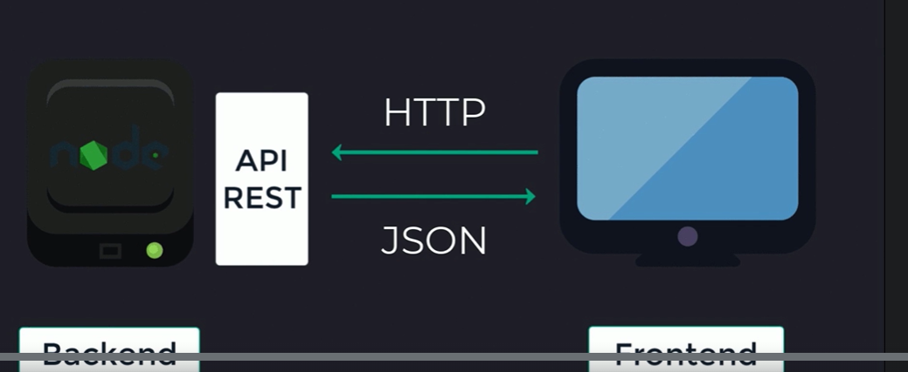
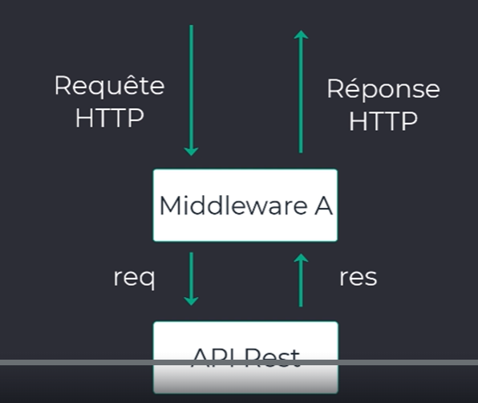
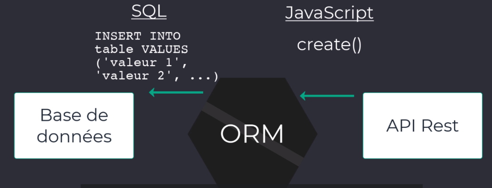
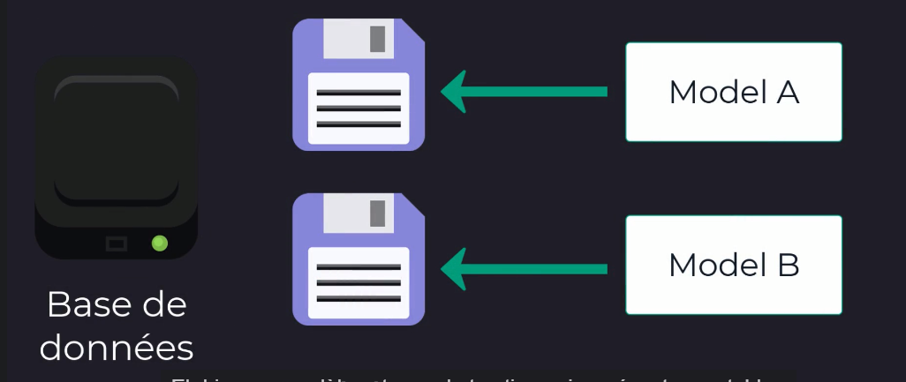
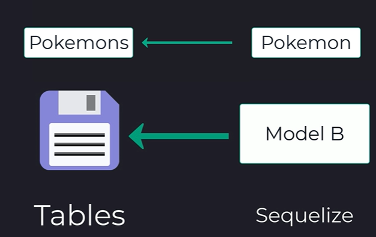

# Développer une API REST avec Node.js

Développez facilement votre API Rest Node.JS à partir d'un dossier vide, avec Node.JS, Express.js et MySQL.

- Créer votre première API Rest NodeJS rapidement, à partir d'un dossier vide
- Installer et interagir efficacement avec une base de données SQL grâce à l'ORM Sequelize
- Comprendre l'éco-système de NodeJS, des API Rest et du Backend
- Sécuriser votre API Rest avec JWT et l'encryptage des mots de passe
- Ajouter une application Angular, React ou Vue à votre API Rest
- Respecter les bonnes pratiques de développements NodeJS et ExpressJS
- Déployer des API Rest modernes, rapides et scalables sur Heroku

## Présentation de Node.js

Environnement d'exécution pour JS.
Exécute code JS côté serveur et non dans navigateur.

### Environnement informatique

Lieu où le code est exécuté, le code du dévelopeur devient un produit utilisable par tous (site web, appli).

JavaScript => environnement d'éxécution => site

L'environnement d'exécution d'un site web => navigateur.
Le navigateur contient un **moteur** jS pour interpréter JS, chaque navigateur à son propre moteur.

- IE: chakra,
- Mozilla: spider monkey,
- chrome: V8.

=> Si code js est interprété par le navigateur, il peut ne pas fonctionner sur un autre navigateur, mais les technologies modernes permettent de lisser ce comportement.

JS => moteur JS => appli web : Node.js pas dedans car côté naviagteur, Node.js = côté serveur (backend).

**Node.js utilise JS donc mteur JS, ce moteur est inclus dans Node.js = V8 (open source).**

>Environnement web = navigateur + moteur js
>Environnement serveur = Node.js + V8 + modules internes à JS, code JS côté serveur

### Node.js versus JS

Les deux sont associés mais différents:

|JS|Node.js|
|-------|------|
|Langage de programmation|Environnement pour le code|
|Code -> exécution moteur navigateur|JS fonctionne à l'extérieur du navigateur|
|Utilisé pour n'importe quelle action à implémenter dans une application web: navigation, ...|Utilisé pour effectuer des opérations sur n'importe quel OS|
|Intzerprété par moteur du navigateur|Moteur V8 inclus|

### Node.js

- Utilise le langage JS
- Facilite fron/back
- utilise le même gestionnaire de paquet NPM, Node Package Manager. Gestion des dépendances avec Node.js
- Rapide
- **Possède une architecture non bloquante**
- Flexible, léger, peu de fonctionnalités (on y ajoute nos modules)
- Contient un écosystème de librairies Open Source grâce à NPM

Sa philosophie:

Rapidité V8 + architecture non bloquante

V8: outil qui interprète js rapidement, méthode de compilation Just-In-Time = transformation JS en code compris par la machine sans passer par un interpréteur (aucun code intermédiaire).

Module non bloquant: événement et  asynchrone dans Node.js.
**Architecture bloquante** = programme récupère des données depuis un serveur distant pour les afficher à l'utilisateur. Il fauat attendre de récupèrer les données demandées pour continuer le programme.
**Architecture non bloquante** = traitement en fonction des événements qui surviennent, , les traitements asynchrones ne bloquent pas l'exécution du programme.

### Types d'applications pouvant être développées avec Node.js

- Développement d'un site entier:
Dans Node. js, il existe un module HTTP qui permet de développer un serveur HTTP.
Toutes les parties serveur site: connexion BDD, routes navigation, renvoie code HTML/CSS, inclure JS depuis Node.js...
JS tapé pour Node.js sera interprété par V8 (code serveur) et le deuxième retourné dans la page client sera interprété par le moteur du navigateur dans utilisateur.
Node.js est plus réactif dans une application avec front et back séparé.
site web => demande page => envoie serveur
appli web => serveur envoie une seule page pour le site puis JS client prend le relais en affichant masquant les données néessaires.
Donc plus de réactivité, aucun rechargement.

- API REST:
API application programming Interface.
Objectif: gestion des accès BDD, et exposer une API REST aux différentes parties visibles du projet.
On peut, par exemple, récupèrer l'API de l'appli web suite au développement de l'application mobile.
Les opérations sur l'API REST sont **unidirectionnelles** = on envoie d'abord une requête à l'initiative du client puis seulement on attend une réponse.

- Application en temps réel:
Toutes les appliactions qui ont besoin de communqiuer rapidement entre le serveur et le front, comme whatsapp...
Dnas le cas d'une messagerie il faut que les informations soient rapides ( messages reçus,...) => implémenter une communication bidirectionnelle entre le serveur et l'application fontaine.
Cela est possible grâce à Node.js et Socket.io (librairie qui utilise cette communication en temps réel).
**Socket.io** possède deux parties:
bibliothèque côté client qui s'exécute dans le navigateur ou équivalent pour une appli mobile, et côté serveur avec Node.js.

- Scripts:
Node.js est utilisé pour développer des scripts = petits programmes qui peuvent être exécuté sur la machine locale.

### JS ESI ou ECMAScript6

Dernière version standardisée de JS (2015).
Dernières versions de Node.js supportent déjà ce standard.
Donc aucune installation.

node.green => liste toute les fonctionnalités de JS et indique si elles sont disponibles ou non dans telle ou telle version de Node.js.

### Node.js et TypeScript

TypeScript est un langage open source développé par Microsoft et permet d'ajouter le typage au langage JS.
Permet d'indiquer si une variable est de tel type, telle fonction doit renvoyer tel ou tel type.
Plus pertinenet côté front, permet de structurer l'état de la donnée.

Nouvelle façon d'utiliser JS en dehors d'un navigateur pour développer toutes sortes d'application.

## Installer Node.js

Récupèrer le fichier d'installqtion => nodejs.org/fr, il existe deux versions:
- LTS = long term support, version la plus stable pour démarrer un projet, cette version sera viable le plus longtemps à l'avenir,
- La version actuelle, soit la dernière version actuelle. Pratique pour tester les fonctionnalités mais peut êttre adapatable.

Installation de deux outils:
installation de Node.js, et NPM( node package manager) qui permet d'installer et gèrer les paquets JS (exemple: Express.js).

## Démarrer un projet Node.js

Dossier, fichier point entrée de l'application = App.js.

Terminal, exécution => node APP.js ou index, server main.js.

Pour démarrer un projet Node.js ou js, il est nécessaire de mettre en place un fichier **package.json** (rapide description du projet, et liste des dépendances de l'appli, et des dépendances des dépendances. On peut égelment y mettre en place des scripts pour  simplifier et automatiser des tâches).
=> soit à la main, soit avec une commande npm = **npm init**.
Dans le fichier, remplacer test par start dans scripts, et enlever echo => node app.js.
Puis npm run start => script appelle node app.js et démarre projet.

### Ajout des dépendances

Pour API REST:
**Express. js = framework pour créer des API REST avec Node.js.**
=> installation:
npm install express --save
npm télécharge express, dans dossier node modules.
npm regarde package.json mais de la librairie express, car paquet js qui a lui même ses dépendances.

--save afin de déclarer express dans les dépendances, et non juste en local sur machine via node modules.

Le dossier node module est géré par npm, ne pas y toucher.

### Express

Envoie d'une requête get via API REST, et a retourné une réponse:

    const express = require('express');
    //  Récupération du paquet express dans code avec require => récup dépendance dans node modules
    const app = express();
    // serveur web sur lequel fonctionnera notre API REST
    const port = 3000 ;
    // port sur lequel nous allons démarrer notre API REST par la suite

    app.get('/', (req, res) => res.send('Hello express'));
    // déf du premier endpoint, coeur d'express. 
    // Chaque élément est important pour définir un point de terminaison:
    // 1- coeur de la requête: get, prend 2 arguments en param => le chemin de la requête, chemin de la route qui va permettre de traiter ce point de terminaison (ici route par défaut) et => fonction qui fournit une réponse à notre client quand point de terminaison est appelé, cette fonction prend également 2 arguments req = récupération de l'objet request qui correspond à la requête reçue en entrée par notre point de terminaison, et res = response objet à renvoyer depuis express au client.
    // Ici on utilise méthode send de l'objet response pour renvoyer le msg

    app.listen(port, () => console.log(`Notre appli Node est démarrée sur : http://localhost: ${port}`));
    // démarre API REST sur port 3000

Lancement de l'API REST avec:
npm run start

En cas de changement de code, il faut couper la commande npm start et relancer, et rafraîchir le navigateur. Il faut y remédier.

### Nodemon

Pour éviter de couper et relancer npm run start => paquet Node.js, **nodemon**.
Il s'occupe d'exécuter le projet Node.js en tâche de fond, à chaque modification, il relance automatiquement l'API REST en prenant compte les dernières modifications.

#### Installation nodemon

**npm install nodemon --save -dev => il existe deux types de dépendances: dépendances du projet dans dependencies, --save et dependencies du projet pendant le développement, devDependencies, comme nodemon.Une fois l'application déployée, elle n'aura pas à être relancée.**

Il faut mettre à jour le script de démarrage: nodemon app.js.

npm run start 

**Accès navigateur: localhost:3000**

>C'est quoi un serveur localhost ? Qu'est-ce que Localhost ? Et comment cela s'applique à ... Dans le réseau informatique, « localhost » fait référence à l'ordinateur sur lequel un certain programme est en cours d'exécution. Par exemple, si vous exécutez un programme sur votre propre ordinateur (comme un navigateur Web ou un environnement de développement Web local), alors votre ordinateur est le « localhost ».

## Découvrir les routes 

Ajout de endpoint à l'API REST: déclaration d'une nouvelle route auprès d'express =>
**point de terminaison express = app.method(chemin, gestionnaire(req, res));**
=> app = instance de l'application express
methode http utilisée
chemin vers ressources sur laquelle on intervient
retour réponse client.

Implémenter nouvelle route:

    app.get('/api/pokemon/1', (req, res) => res.send("Hello Bulbizar"));
    // appel nouvelle route dans navigateur => localhost:3000/api/pokemons/1
    = nouvel endpoint dans API REST

### Passer un paramètre depuis l'URL

Si trop de routes?
=> express permet de récupèrer des paramètres de l'URL depuis les endpoints, récupération de l'id du pokemon dans l'URL , la récupèrer dans le point de terminaison, et construire une réponse à partir de ces informations.
Depuis notre endpoint, on possède déjà un objet représentant la requête entrante = req, pour accèder aux paramètres id de l'URL => req.params.id.
L'on peut faire passer plusieurs paramètres différents à un endpoint.
Exemple:

### Mettre en place un environnement de données

Actuellement, on ne renvoie que des chaînes de caractères statiques.
Mise en place d'un jeu de données.
Module js et récupération avec un point de terminaison:

    module.exports = pokemons;
    <!-- dans fichier mock-pokemon , création du module pour import -->
    let pokemons = require('./mock-pokemon');
    // importation du module mock-pokemon, voir fichier app.js
    
### Relier les données et routes d'Express

    app.get('/api/pokemons/:id', (req, res) => {
    // ajout valeur dynamique id avec :id, acceptation du paramètre. Express le récupère et le transmets à notre point de terminaison via l'objet req.
        // const id = req.params.id;
        // récupération des paramètres id de l'URL
        const id = parseInt(req.params.id);
        //  conversion de la chaîne de caractère en number 
        // res.send(`Vous avez demandé le pokemon n° ${id}`); = message indiquant l'id choisi
        const pokemon = pokemons.find(pokemon => pokemon.id === id);
        // constante qui permet de récupèrer dans le fichier pokemon l'objet choisi grâce à l'id
        res.send(`Vous avez choisi: ${pokemon.name}`);
        // message envoyé: nom du pokemon, nam dans objet pokemon suite à la sélection de l'id.
        // message erreur name undefined, méthode find ne renvoie rien.
        // Routeur d'express passe les paramètres sous forme de chaînes de caractères systématiquement, le paramètre id devient une chaîne de caractère => pokemon.id === id => comparaison de deux valeurs non identiques => false, il faut convertir la chaîne de caractère en un nombre => méthode js native parse int

## Les réponses Json

Rappel:
rôle d'une API REST => intercepter une requête http, puis retourner une réponse contenant les informations demandées par le client au format **JSON**.
Mais la requête HTTP est elle valide, car pour le moment l'on ne renvoie que des chaînes de caractères avec res.send().

s

Renvoie d'une vraie réponse HTTP, les différents éléments nécessaires pour retourner une vraie réponse HTTP:
- les **données**: sont elles bien retournées?
- **format JSON**: données doivent être au format JSON,
- **le type mime**: il est nécessaire d'indiquer un type mime lorsque l'on utilise le protocole HTTP. Ajout sous forme d'une entête à la réponse HTTP,
  Demande d'une simple page via le navigateur => type Mime est ajouté.
- **le code de statut**: code à 3 chiffres indiquant le statut de la réponse, non présent dans la requête HTTP mais seulement dans la réponse ex: 200 ok 404).

  Dans le cas d'une réponse JSON, le type Mime est = Content-Type: application/json.
  Page web simple: Content-Type: text/html

### Retourner une réponse au format JSON

La conversion de nos réponses au format JSON se fait en 2 étapes:
- convertir le corps de la réponse en JSON plutôt que des chaînes de caractères,
- Ajouter un type MIME dans la réponse http pour indiquer que cette réponse contient du JSON.
=>
**Express permet cela grâce à une méthode: res.json().** Elle prend en charge le retour au format Json et le type Mime application.json.

### Embellir la réponse du navigateur

Renvoie réponse au format json, ce sont des applications donc du code qui vont consommer les réponses de notre API REST, mais la réponse peut être illisible pour nous en phase de développement ou debbug.
La plupart des navigateurs récents permettent d'obtenir une extension pour améliorer l'affichage des réponses au format JSON:
**Chrome: JSON viewer**.

### Organiser la structure des réponses

La réponse est-elle complète?
exemple, retour des données, les infos sont bonnes mais à la place des développeurs front end qui consomment l'API REST, il faut confirmer que tout c'est bien déroulé ou erreurs.
Il vaut mieux être trop précis avec une API REST.

Création fichier helper.js.

    exports.success = (message, data) => {
        return {
            message: message,
            data
        }
    }
    // méthode success avec deux param pour construire une réponse
    // export
    // il existe une syntaxe d' ecma 6 permettant de fusionner la prropriété et la valeur d'un objet js s'ils ont le même nom
    // exemple:
    // const pokemon = { name: name};
    // avec raccourci ECMAScript 6: const pokemon ={name};

    exports.success = (message, data) => {
        return {
            message, data
        }
    }

### Améliorer les points de terminaison

helper => améliore et complète la réponse pour le consommateur de l'API REST

Ajout message dans les réponses json

    res.json(helper.success(message, pokemon));
    => retour d'une réponse complète

On peut alléger le code, en récupérant success plutôt que helper en entier = **affectation destructurée**

    // const helper = require('./helper.js');
    const {success} = require('./helper');

### Retourner une liste de données au format json

Exercice2:
Ajouter un endpoint qui renvoie la liste complète des pokemons au format json, avec un message.
Cahier des charges:
- reprendre la route api/pokemons pour avoir la totalité des pokemons,
- retourner les 12 pokemons,
- un message indiquant que l'on retourne les 12 pokemons,
- format json.

    app.get('/api/pokemons', (req, res) => {
        const message = 'La liste des pokémons a bien été récupérée.'
        res.json(success(message, pokemons)) 
    })

## Les middlewares Express

### Définition

Express est en grande partie basé dessus.
**Ce sont des fonctions js capables d'intéragir avec des requpetes entrantes et sortantes de l'API REST.**

Le middleware A, permet d'appliquer un traitement aux requêtes entrantes et sortantes.

Les middlewares fonctionnenet par dessus les endpoints existants.
Ils peuvent accèder aux objets res et res d'express.
Une fois le traitement des middlewares effectués, il faut l'indiquer grâce à la fonction **next()**.

Les éléments req, res et next sont transmis par express directement.

    const middleware(req, res, next) => {
        <!-- traitement quelconque, on peut intervenir sur les objets req et res, puis on indique à express que le traitement est terminé -->
        next()
    }
     => middleware

Fonctions js qui ont accès à certaines données d'Express.

### Cas d'utilisation

Les middlewares sont une fonctionnalité d'express suffisamment polyvalente pour effectuer des tâches très diverses.

5 catégories d'utilisation:

- Middleware d'application:

    var app = express();

    <!-- On passe u  middleware en paramètre de la méthode use(): -->
    app.use(function (req, res, next){
        console.log('Time:', Date.now());
        next();
    });

Ce sont les middlewares les plus courants lorsque l'on débute dans le domaine, reliés directement à l'instance d'express grâce à la méthode use().
Le middleware sera exécuté à chaque fois que l'API REST recevra une commande.
Dans ce cas, on affichera un message dans le terminal de commande avec la date complète à laquelle notre API REST a reçu la requête entrante.
On peut utiliser ce type de middleware pour loger tout type d'événement ou pour autre traitement commun aux requêtes entrantes ou sortantes de notre API REST.

- le middleware du routeur:

Il fonctionne directement au niveau du routeur d'Express.
Très similaire au précédent mais pas relié à l'instance d'Express. On le branche sur une instance d'express routeur:
express.Routeur() => création de sous ensemble de routes et définir une hiérarchie et une organisation entre les routes de l'API REST, dans le cas où celle-ci devient importante en taille.

- middleware traitement d'erreur:

    app.use(function(err, req, res, next){
        console.log(err);
        res.send('erreur!');
    });

Il prend quatre arguments en compte pour être identifié, sinon avec 3 express pensra qu'il s'agit d'un middleware ordinaire et ne géreré pas les erreurs correctement.

- le middleware intégré

Il existait quelques middlewares directement intégrés à Express, comme modules dans Node.js.
Mais un seul reste depuis la v4 => express.static
Il a comme responsabilité de servir des documents statiques depuis une API REST comme des images, PDF...
Les autres sont toujours maintenus et utilisables, mais disponibles sous forme de dépendances extérieures à installer.

- les middlewares tiers:

Disponibles sous la forme d'une dépendance extérieure.
Sont des modules js à installer dans node modules.

### Créer un middleware sur mesure

Création d'un middleware qui affichera les requêtes reçues par l'API REST directement sur le terminal de commande où s'exécutent notre backend.

Déclaration nouveau middleware = logger directement dans le point d'entrée app.js.

    // const logger = (req, res, next) => {
    //     console.log(`URL: ${req.url}`);
    //     next();
    // }
    // middleware logger, 3 paramètres
    //  la req http reçue en entrée , la réponse http qui va être exposée au client, la méthode next fournie par Express qui ndique que le traitement est terminé.
    // loggue l'URL des points de terminaison appelée par les consommateurs de notre API REST.
    // l'on peut supprimer la var intermédiaire , plus concis

    // app.use(logger);
    // utilisation du nouveau middleware dans l'application express grâce à use
    // après suppression de la var intermédiaire:
    app.use((req, res, next)=> {
        console.log(`URL: ${req.url}`);
        next();
    });
Permet de débugger à la main.

### Installer un middleware déjà existant

Middleware **morgan** => s'occupe de la même chose que notre middleware précédent.
Permet de logger dans le terminal de commande toutes les requêtes entrantes vers notre API, en plus aboutie sans ligne de code.

Module js comme un autre.

npm install morgan --save-dev
Surtout utile pour le débugage en phase de dév.

Il faut ensuite l'importer dans app.js.

### Communication entre les middlewares

Ils puvent être combinés entre eux et former une chaîne de traitement complète.

Ils communiquent entre eux en transmettant leurs paramètres respectifs.
Il est possbile de chaîner des middleware sans transmission de paramètres.

Ajout d'un deuxième middlkeware et le combiner avec morgan.
Bien penser à appeler la fonction next pour chaque middleware, cela permet de transmettre l'exécution au middleware suivant dans la chaîne de traitement.

 => ajout favion à l'API REST

npm install serve-favicon --save

**L'extension d'une favicon est toujours favicon.ico**

    app
        .use(favicon(__dirname + '/favicon.ico'))
        .use(morgan('dev'));
    // combi des middleware, bien télécharger favicon
    // appel de la méthode use autant de fois que l'on a de middlewares à implémenter
    // on peut les chaîner les uns à la suite des autres afin d'établir un ordre en eux

__dirname est une variable d'environnement qui vous indique le chemin absolu du répertoire contenant le fichier en cours d'exécution.
Chaque middleware va renvoyer des données, la requête, la réponse, la fonction suivante à appeler après avoir terminé son traitement spécifique.

La méthode next est toujours appelée mais par le middleware directement.

## Création d'une API REST complète

Ajout d'un nouveau pokemon:
construire un nouvel endpoint qui acceptera la requête http: 
  - action http post,
  - URL de la ressource, ressource sur laquelle l'on souhaite intervenir = /api/pokemons, (collections de ressources),
  - les données du pokemon, au formaj json.
  

    app.post('/api/pokemons', (req, res) =>{
        // post auprès d'express avec url associée
        const id = 123;
        // définition id arbitraire, doit être unique pour générer url unique. On ne peut pas deviner un id déjà pris,  c'est la bdd de déterminer les id uniques, elle seule a accès à l'ensemble des pokemons existants
        const pokemonCreated = {...req.body, ...{id: id, created: new Date()}}
        // fusion des données du pokemon reçues via la requête http entrantes avec l'id unique généré + date de création
        pokemons.push(pokemon.created);
        // ajout à la liste existante
        const message1 = `le pokemon ${pokemonCreated.name} a bien été créé`;
        res.json(success(message1, pokemonCreated));
    });

Pour récupèrer le plus grand id existant dans la liste et incrémenter.
On va ajouter la méthode de génération d'id dans helper car fichier outil.

    // ajout méthode pour id
    exports.getUniqueId = (pokemons) => {
        const pokemonsIds = pokemons.map(pokemon => pokemon.id);
        // transfo tableau des pokemons en un tableau d'id des pokemons. méthode map comme for mais en retournant un nv tableau
        const maxId = pokemonsIds.reduce((a, b) => Math.max(a, b));
        // méthode js native reduce qui permet de comparer les éléments deux à deux dans un tableau 
        const uniqueId = maxId ++;
        return uniqueId;

Par la suite, c'est la bdd mySql qui s'en chargera.

    {
    "name": "Chenipan",
    "hp": 29,
    "cp":4,
    "picture": "https://assets.pokemon.com/assets/cms2/img/pokedex/detail/010.png",
    "types": ["Insecte", "Poison"]
    }

        app.post('/api/pokemons', (req, res) =>{
        // post auprès d'express avec url associée
        const id = getUniqueId(pokemons);
        // définition id arbitraire, doit être unique pour générer url unique. On ne peut pas deviner un id déjà pris,  c'est la bdd de déterminer les id uniques, elle seule a accès à l'ensemble des pokemons existants. usage méthode dans helper
        const pokemonCreated = {...req.body, ...{id: id, created: new Date()}}
        // fusion des données du pokemon reçues via la requête http entrantes avec l'id unique généré + date de création
        pokemons.push(pokemon.created);
        // ajout à la liste existante
        const message1 = `le pokemon ${pokemonCreated.name} a bien été créé`;
        res.json(success(message1, pokemonCreated));
    });

localhost:3000/api/pokemons

Pas les données id et created, c'est au backend d'attribuer un id unique, created pas de valeur dynamique depuis fichier json => c'est le serveur qui se charge de la date de création des ressources.

=>

    {
        "message": "le pokemon undefined a bien été créé",
        "data": {
            "id": 14,
            "created": "2023-06-22T12:46:26.225Z"
        }
    }
 =>renvoie chaîne de caractères, quand les dinnées http transitent via le protocole http, elles ne oeuvent l'être que sous la forme d'une chaîne de caractères.
Conversion en chaines de caractère en json.

### Parser nos données avec un middleware

Comment récupèrer des données au format json depuis notre API REST.
Il existe deux opérations majeures lorsque l'on utilise le format json:
- **On peut parser une chaîne de caractères afin d'obtenir du json. Grâce à la méthode native du nav: JSON.parse()**:
  
    const userString = '{"name: "john", "age": 33}'
    => réception données sous fore de chaîne de caractères

    const userJson = JSON.parse(userString);
    => on parse la chaîne de caractère afin d'obtenir du json utilisable partout dans le code, sans import car méthode native.

- on peut **stringyfier** un json afin d'obtenir une chaîne de caractères (retour client), méthode JSON.stringify:

    console.log(JSON.stringify(userJSON));
    => en paramètres données au format json.

Une chaîne de caractères en js n'a pas de propriété âge, alors que pour json c'est tout à fait possible.
Mise en place du middleware **body parser**.

=> npm install body-parser --save

### Modifier un pokemon

Avec action http **put**, mofication de l'ensemble de la ressource côté api rest;
Pour modifier seulement le nom, l'on ne modifie pas directement la ressource, l'on en crée une nouvelle avec la modification souhaitée et l'on remplace l'ensemble de la ressource souhaitée par la nouvelle => si deux modifications de la même ressource en même temps => risque de collision, contrairement à la soumission de la nouvelle version complète de la ressource, où les modifications peuvent s'enchaîner les une à la suite des autres logiquement.
**Chaque modification introduit qu'un seul et unique effet de bord sur le serveur plutôt que des changements de propriétés de tous les côtés.**
Pour modfier seulement une partie de ressource, en http, il existe une autre opération = **patch**, mais plutôt put. C'est une méthode plus fiable.
(put patch idempotence)[https://blog.octo.com/should-i-put-or-should-i-patch/]

test modification:

    {
    "name": "Anneso",
    "hp": 29,
    "cp":4,
    "picture": "https://assets.pokemon.com/assets/cms2/img/pokedex/detail/010.png",
    "types": ["Insecte", "Poison"]
    }

Dans le premier cas, on a des accolades supplémentaires entourant les propriétés qui sont ajoutées aux pokemon. La différence, dans le deuxième cas on ajoute une seule propriété, dans le premier un ensemble de deux propriétés à l'objet initial.

### Supprimer un pokemon

**delete**

**Dans une API REST, les collections de ressource sont également des ressources.**
Appel méthode delete sur URL /pokemons/1 => suppression d'un pokemon
Appel méthode delete sur URL /pokemons => suppression tout les pokemons.

### Exercice: vérifier que l'API fonctionne

Exécution des requêtes:
(npm start pour r"initialiser la liste)

## Lien avec la base de données

### Comprendre le rôle d'un ORM

**ORM**:
Object Relationnal Mapping, technique de programmation puissante qui permet de convertir les bases de données dans des langages comme js.
Masque complétement le fait qu'il y ait une base de données.
On continue le développement de l'API REST, mais on intéragir avec des objets js fournis par l'ORM.
On appelle des méthodes sur des objets JS.

Pas besoin de connaître le SQL.
Abstracation de la bdd, on peut changer de bdd sans modifier le code des requêtes sql,
Si on crée un nouvel objet js, l'ORM va s'occuper de le pousser en bdd (comme maj, suppression,...),
Fournit les requêtes les plus basiques,

### Installer l'ORM Sequelize

Il existe un ORM js pour les bdd SQL qui sort du lot: **Sequelize**.
Sequelize destinés aux utilisateurs de Node.js, entièrement basé sur les promesses de js.
Il permet donc de gérer les traitements async de manière plus efficace que de simples callback.
On a beaucoup de taitements async car lors de l'appel de la bdd, il y a un délai de réponse.
Intéraction avec la BDD depuis l'API REST.

Installation:

npm install sequelize --save
Il faut installer un **driver** => Sequelize crée une couche d'abstraction par rapport à la base de données utilisée. Cependant il y a bien un moment où l'on se connecte à la bdd, d'où le driver.
Chaque bdd SQL a son propre driver afin de permettre à l'ORM d'intéragir avec elle.

npm install --save mysql2
[Sequelize](https://sequelize.org/docs/v6/getting-started/)

### Connecter MySQL et l'API REST

Union Sequelize, mySQL, et API REST.
Il faut les assembler si l'on veut obtenir un résultat.
Sequelize est très simple à configurer =>
app.js ajout du code nécessaire pour se connecter à mySQL via Sequelize.
3 étapes:
- import Sequelize,
- création et configuration d'une instance de la classe de Sequelize,
- test si connexion ok avec méthode authenticate de Sequelize.

Création bdd:
create database pokedex;
use pokedex;

### Réflexion sur l'organisation du code

app.js a trop de rôles différents:
initialisation du serveur Express,
connexion à la bdd,
gestion des routes et points de terminaison,...
Il contient trop de code.

Notre architecture doit être adpatée aux besoins du projet, migration vers des modules js à part qui auront un rôle dédié.

3 rôles différents:
points de terminaison,
démarrage du serveur,
intéraction bdd.

Ici intégration de plusieurs outils et de configuration, on va construire par dessus notre API REST une véritable base de données.

## API REST et base de données

### Présentation des modèles Sequelize

Fonctionnement de Sequelize:

nous devons prendre connaissance du concept de modèle ou **models**: essence même de Sequelize.

Qu'est ce qu'un models:

Un models est une abstraction qui représente une table dans notre bdd.
Avec Sequelize on va donc déclarer un modèle Pokemon qui représentera la table contenant les pokemons du côté de notre bdd.

Un modèle est un objet js spécifique fourni par Sequelize, que l'on peut paramètrer en fonction de nos propres besoins.
Cet objet spécifique contient plusieurs propriétés qui décrivent à Sequelize la structure de l'entité qui doit être stocké (ex:adresse image, PV,...), pour chacune de ses propriétés il faut préciser le type de la propriété.

On déclare des objets avec certaines propriétes en js dans le code de l'PAI REST et Sequelize s'occupe du reste, il fournit la couche d'abstraction dont on a besoin.
Nous devrons donner un nom à chaque models Sequelize que nous créerons.
Exemple, un modèle pokemon afin de modéliser un pokemon. Sequelize va se baser sur ce nom et va lui ajouter la lettre s en suffixe pour déterminer le nom de la table.
Ainsi, la table associée au pokemon se nommero => pokemons.

Sequelize se contente de passer le nom au pluriel pour déterminer le nom d'une table.

### Créer un modèle Sequelize

Déclarer un objet js en respectant les conventions proposées par Sequelize.

Création d'un dossier src et dedans un dossier models.
Cela nous permettra de mieux structurer notre code et commencer à préparers l'architecture de notre API REST.

Le dossier src contiendra notre code source de notre API REST, le models contiendra les models Sequelize de notre projet.

Création du models pokemons.js dans models.

    module.exports = (sequelize, DataTypes) => {
    return sequelize.define('Pokemon', {
        // export  fonction de deux param: sequelize = objet représente la co à la bdd pour Sequelize, cet objet possède une propriété define qui permet de déclarer un nouveau models auprès de sequelize et datatypes = définit les types de données de chaque propriétés du models ex: name => string

### Syncrhoniser la bdd avec Sequelize

L'on peut maintenant piloter la bdd directement depuis du code js.
Voir import src models, sync.

    // synch avec l'état de la bdd avec méthode sync. En arrière plan: synch de tous les models Sequelize de l'API REST avec la bdd
    // force: true permet de supprimer la table associée à chaque modèle avant d'effectuer la synchro, on perd les données de la table à chaque synchro à terme nous nous en débarasserons

### Instancier un modèle Sequelize

La table est vide, il faut donc la remplir.
Comment?

Sequelize => ajout de pokemon, il faut créer des instances grâce au model.
**Chaque models Sequelize possède une méthode create.**